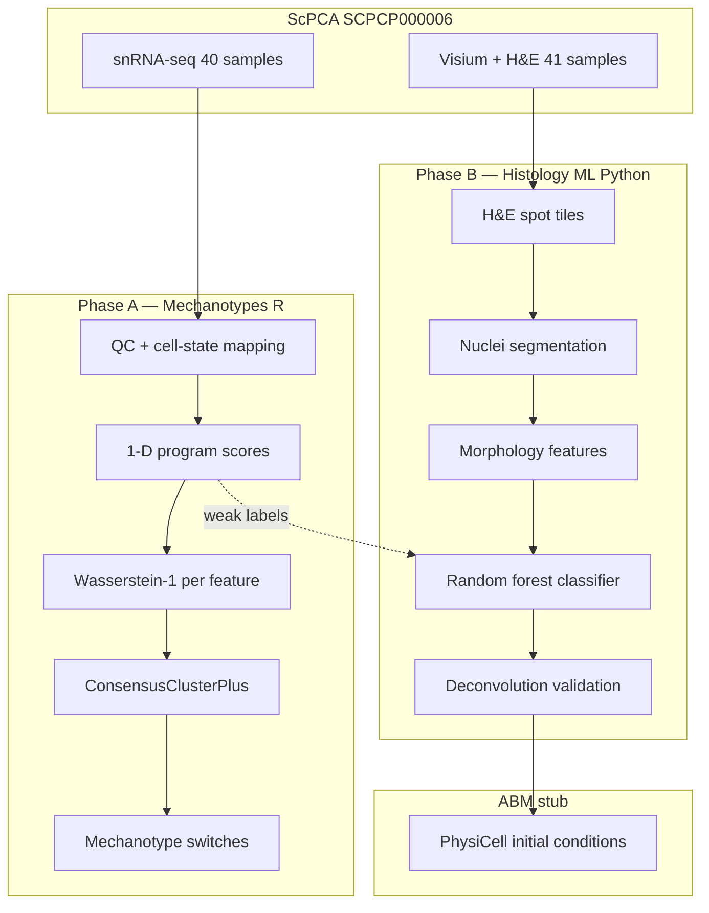

# sc-wilms-data

**Wilms tumor distributional mechanotypes + histology-informed spatial composition**

Computational pipeline connecting the Radhakrishnan lab's **Wasserstein mechanotyping framework** (Phase A) to **Visium H&E morphology ML** (Phase B) for the public ScPCA cohort [**SCPCP000006**](https://scpca.alexslemonade.org/projects/SCPCP000006) — paired snRNA-seq, Visium spatial transcriptomics, H&E images, and bulk RNA-seq from favorable and anaplastic Wilms tumors.

> **Scientific goal:** Identify how whole *distributions* of interpretable molecular programs differ across Wilms compartments and histology, then validate whether H&E-derived spatial cell-state composition agrees with transcriptomics — a prerequisite for morphology-informed agent-based models (PhysiCell).

---

## Table of contents

1. [Why this matters](#why-this-matters)
2. [Pipeline overview](#pipeline-overview)
3. [Data & cohort](#data--cohort)
4. [Phase A — Mechanotypes (snRNA-seq)](#phase-a--mechanotypes-snrna-seq)
5. [Phase B — Histology ML (Visium H&E)](#phase-b--histology-ml-visium-he)
6. [Results summary](#results-summary)
7. [Figure gallery](#figure-gallery)
8. [Quick start](#quick-start)
9. [Repository layout](#repository-layout)
10. [Configuration](#configuration)
11. [Limitations & next steps](#limitations--next-steps)
12. [References & citation](#references--citation)

---

## Why this matters

Wilms tumor (nephroblastoma) is morphologically organized into **blastemal**, **epithelial**, and **stromal** compartments, with clinically dominant **favorable vs anaplastic** histology. Most single-cell analyses compare *means* or cluster proportions; this repo implements the lab's alternative: compare **entire distributions** of predefined 1-D program scores via **Wasserstein-1 distance** and **consensus clustering**, then ask which compartments **switch mechanotype** between histology groups.

Separately, spatial ABM models often assume uniform or deconvolution-only initial conditions. Phase B extracts **observed** compartment fractions from paired H&E at nucleus resolution and validates them against the same gene programs measured in Visium spots — bridging morphology and transcriptomics on the same tumors.

**Novelty:** To our knowledge, this is the first application of distributional Wilms mechanotyping on ScPCA snRNA data combined with weakly supervised H&E classification validated against spot-level programs.

---

## Pipeline overview



**Reproducibility:** All stochastic steps use seed `42` (logged). Intermediates live in `data/processed/`; headline outputs in `results/`.

---

## Data & cohort

| Modality | Count | Use |
|----------|-------|-----|
| snRNA-seq (nucleus) | 40 samples | Phase A mechanotypes |
| Visium spots + H&E | 41 samples | Phase B morphology ML |
| Bulk RNA-seq | 45 samples | Optional validation (not wired) |

**Histology:** 23 favorable / 22 anaplastic (`subdiagnosis` in ScPCA metadata).

**Access:**
- **Metadata (no token):** `python scripts/fetch_scpca_metadata.py`
- **API download:** `ScPCAr` R package ([docs](https://alexslemonade.github.io/ScPCAr/))
- **Manual download (recommended on Windows):** Portal zips → `scripts/ingest_manual_downloads.ps1`

Raw data are **never committed**; provenance logged in `data/raw/scpca_access_log.txt`.

---

## Phase A — Mechanotypes (snRNA-seq)

### Methodology (research-grade)

| Step | Script | Method |
|------|--------|--------|
| Ingest | `scripts/ingest_manual_scpca.R` | Load merged SCE; join `subdiagnosis` histology |
| QC | `02_qc_normalize.R` | ≥200 genes/cell; map OpenScPCA `cellassign` → blastemal/epithelial/stromal |
| Scores | `03_compute_scores.R` | **Fixed** gene programs (`config/features.yaml`): log1p(CPM<sub>pos</sub>) − log1p(CPM<sub>neg</sub>) via `gene_symbol` |
| Items | `04_wasserstein_matrix.R` | Groups = (compartment × histology); **≥25 cells** rule |
| Distance | `04_wasserstein_matrix.R` | **1-D Wasserstein-1 only** on score distributions (`transport` package) |
| Clustering | `05_consensus_cluster.R` | ConsensusClusterPlus PAM; k via low **PAC** + high **Calinski–Harabasz** |
| Switches | `07_mechanotype_switches.R` | Flag compartment if cluster assignment differs favorable vs anaplastic |
| Figures | `08_figures.R` | W1 heatmaps, switch heatmap, score violins, PAC/CHI curves |

Methods log: `results/mechanotypes/phase_a_methods.yaml`

### Key design choices

- **No feature fishing:** six programs predefined before clustering (blastemal, epithelial, stromal, proliferation, WT1, Wnt/β-catenin).
- **1-D Wasserstein:** multivariate Wasserstein on gene matrices underperforms on scRNA-seq (benchmarked in lab framework).
- **Cell-state mapping:** `cellassign_celltype_annotation` → Wilms compartments (Kidney progenitor → blastemal, Podocyte → epithelial, etc.). ~61k / 200k cells map; unmapped cells excluded from mechanotyping.

### Phase A results (current run)

| Metric | Value |
|--------|-------|
| Cells after QC | **61,222** (with compartment + histology) |
| Clustering items | 6 per feature (3 compartments × 2 histology levels) |
| Mechanotype switches | **11 / 18** feature×compartment pairs |
| Strongest W1 separation | blastemal favorable vs anaplastic ≈ **0.245** (blastemal program) |

**Switch pattern:** Blastemal compartment switches mechanotype on **all six** features. Epithelial switches on epithelial program, stromal program, Wnt, and WT1. Stromal compartment is stable (same cluster) across features.

Consensus details: `results/mechanotypes/consensus_summary.csv`

---

## Phase B — Histology ML (Visium H&E)

### Methodology

| Step | Script | Method |
|------|--------|--------|
| Tiles | `01_extract_tiles.py` | Visium hires H&E patches centered on tissue spots; **Macenko** stain norm (ref `SCPCL000438`) |
| Programs | (in 01) | Same Phase A gene scores on spot RNA → dominant state + softmax fractions |
| Segment | `02_segment_nuclei.py` | **Hematoxylin watershed** (StarDist requires TensorFlow; configurable) |
| Features | `03_nucleus_features.py` | Area, eccentricity, solidity, texture, H-intensity, neighbor density |
| Labels | (weak) | Dominant spot program propagated to all nuclei in spot |
| Train | `04_train_classifier.py` | Random forest; **sample-level holdout**; high-confidence spots (program margin ≥ 0.12) |
| Validate | `05_spot_fractions.py` | H&E fractions vs RNA softmax deconvolution (Pearson / Spearman) |
| ABM | `06_map_to_physicell.py` | Map fractions → PhysiCell initial cell JSON (stub without binary) |
| Figures | `07_figures.py` | Deconv scatter, confusion heatmap, segmentation mosaic, metrics summary |

Methods log: `results/classifier/phase_b_methods.json`

Config: `config/phase_b.yaml` (default: 6 libraries, 80 spots/library = 480 tiles pilot)

### Phase B results (current run)

| Metric | Value |
|--------|-------|
| Visium spot tiles | **480** (6 libraries, 3 tumors) |
| Nuclei segmented | **21,365** |
| Holdout sample | SCPCS000168 (anaplastic) |
| Nucleus balanced accuracy | 0.33 (weak labels + mixture spots) |
| **Dominant-state agreement** (H&E vs RNA) | **72%** |
| Epithelial fraction Pearson *r* | **0.45** (*p* ≪ 0.001) |
| Stromal fraction Pearson *r* | 0.27 |
| Blastemal fraction Pearson *r* | 0.23 |

**Interpretation:** Nucleus-level classification under weak spot labels is intentionally hard (each Visium spot ≈ 10–20 cells). **Spot-level transcriptomic validation** — especially epithelial *r* ≈ 0.45 and 72% dominant-state agreement — supports that morphology captures compartment composition, not perfect per-nucleus labels.

---

## Results summary

| Goal (PRD) | Status | Evidence |
|------------|--------|----------|
| G1 Mechanotype switches | ✓ | 11 switches; blastemal switches all features |
| G2 H&E → fractions + validation | ✓ Pilot | Deconv correlations significant; dominant agreement 72% |
| G3 ABM from H&E fractions | ✓ Stub | `results/abm/run_001/` |
| G4 Reproducible repo | ✓ | Pinned env, numbered scripts, config-driven paths |

---

## Figure gallery

Regenerate all figures:

```powershell
scripts\run_figures.bat
```

| Figure | Description |
|--------|-------------|
| [`phase_a_w1_heatmaps.png`](results/figures/phase_a_w1_heatmaps.png) | Pairwise W1 distances per feature program |
| [`phase_a_mechanotype_switch_heatmap.png`](results/figures/phase_a_mechanotype_switch_heatmap.png) | Switches favorable ↔ anaplastic by compartment |
| [`phase_a_score_distributions.png`](results/figures/phase_a_score_distributions.png) | WT1, blastemal, proliferation score violins |
| [`phase_a_consensus_metrics.png`](results/figures/phase_a_consensus_metrics.png) | PAC & CHI vs k for consensus clustering |
| [`phase_b_deconv_validation.png`](results/figures/phase_b_deconv_validation.png) | H&E vs RNA spot fractions (3 compartments) |
| [`phase_b_dominant_state_confusion.png`](results/figures/phase_b_dominant_state_confusion.png) | Dominant compartment agreement matrix |
| [`phase_b_fractions_by_histology.png`](results/figures/phase_b_fractions_by_histology.png) | Composition by favorable vs anaplastic |
| [`phase_b_segmentation_mosaic.png`](results/figures/phase_b_segmentation_mosaic.png) | Segmentation QC on sample tiles |
| [`phase_b_classifier_summary.png`](results/figures/phase_b_classifier_summary.png) | Accuracy metrics + correlation bar chart |
| [`mechanotype_switches.png`](results/figures/mechanotype_switches.png) | Bar chart of switches (from script 07) |

Segmentation overlays (480): `data/processed/nuclei/overlays/`

---

## Quick start

### 1. Environment

```powershell
# Python deps (Phase B)
pip install scanpy scikit-learn scikit-image opencv-python-headless pyarrow pyyaml matplotlib seaborn scipy

# R 4.x + packages (Phase A)
winget install RProject.R
scripts\rscript.bat scripts\install_r_packages.R
scripts\rscript.bat scripts\scpca_auth.R   # optional for API download
```

Or: `conda env create -f environment.yml && conda activate sc-wilms-data`

### 2. Metadata (no download)

```powershell
python scripts/fetch_scpca_metadata.py
```

### 3. Manual data ingest (recommended)

Place Portal zips in Downloads, then:

```powershell
powershell -File scripts/ingest_manual_downloads.ps1
scripts\rscript.bat scripts\ingest_manual_scpca.R
```

### 4. Run pipelines

```powershell
# Phase A: QC → mechanotypes → figures
scripts\run_phase_a.bat

# Phase B: requires spaceranger extract; sets WILMS_DEMO=0
scripts\run_phase_b.bat

# Figures only
scripts\run_figures.bat
```

### 5. Tests

```powershell
pytest -q
scripts\rscript.bat -e "testthat::test_dir('tests', filter = 'phase1')"
```

---

## Repository layout

```
sc-wilms-data/
├── config/                  # paths.yaml, features.yaml, phase_b.yaml, physicell.yaml
├── phase1_mechanotypes/     # R: 00–08 numbered scripts
├── phase2_histology_ml/     # Python: 01–07 numbered scripts
├── scripts/                 # ingest, run_phase_*.bat, fetch metadata
├── data/raw/                # gitignored ScPCA downloads
├── data/processed/          # gitignored intermediates (SCE, scores, tiles, nuclei)
├── results/
│   ├── mechanotypes/        # consensus RDS, switches CSV, methods YAML
│   ├── classifier/        # model, metrics, deconv JSON
│   ├── figures/             # publication-style PNGs
│   └── abm/                 # PhysiCell stub outputs
├── tests/
├── PRD.md                   # requirements & acceptance criteria
├── AGENTS.md                # agent/human coding rules
└── .learnings/LEARNINGS.md  # accumulated gotchas
```

---

## Configuration

| File | Purpose |
|------|---------|
| `config/features.yaml` | **Fixed** Phase A gene programs, consensus params, seed |
| `config/paths.yaml` | All relative paths (no hard-coded absolutes) |
| `config/phase_b.yaml` | Visium tile size, library limits, segmentation, classifier |
| `config/physicell.yaml` | ABM domain and cell-type parameter mapping |

**Important:** Set `WILMS_DEMO=0` (or use `run_phase_b.bat`) for real Visium processing. `WILMS_DEMO=1` generates synthetic tiles for CI only.

---

## Limitations & next steps

1. **Cellassign → compartment mapping** is approximate; refine with OpenScPCA/Wilms-specific labels.
2. **Phase A coverage:** only ~30% of nuclei map to three compartments after QC.
3. **Phase B scale:** pilot uses 6/41 Visium libraries; increase `max_libraries` in `config/phase_b.yaml`.
4. **Segmentation:** watershed baseline; install TensorFlow + set `segmentation_method: stardist` for PRD-default StarDist.
5. **waddR decomposition** (`06_waddR_decompose.R`): optional location/shape/size interpretation — requires Bioconductor on Windows.
6. **PhysiCell:** stub JSON only; full simulation on cluster with PhysiCell binary.

---

## References & citation

- ScPCA Portal & `SCPCP000006`: [Alex's Lemonade ScPCA](https://scpca.alexslemonade.org/) · preprint [10.1101/2024.04.19.590243](https://doi.org/10.1101/2024.04.19.590243)
- ScPCAr R package: [GitHub](https://github.com/AlexsLemonade/ScPCAr)
- Wasserstein mechanotyping framework: Radhakrishnan lab pan-cancer mechanobiology work (W1 + ConsensusClusterPlus + n≥25 rule)
- waddR: 2-Wasserstein decomposition for scRNA-seq
- Visium: 10x Genomics spatial; Macenko stain normalization; StarDist H&E nuclei (`2D_versatile_he`)

**Lab context:** Multiscale intrinsic–extrinsic coupling (PhysiCell ABM) — see `PRD.md` appendix.

---

## ScPCAr API cheat sheet

| Task | Function | Auth? |
|------|----------|-------|
| List projects | `scpca_projects()` | No |
| Sample table | `get_project_samples("SCPCP000006")` | No |
| Agree to terms | `get_auth(email, agree=TRUE)` | — |
| Download merged SCE | `download_project(..., format="sce", merged=TRUE)` | Yes |
| Download Visium | `download_project(..., format="spatial")` | Yes |

**Deprecated:** `download_sample()` — use `create_dataset()` → `download_dataset(await_processing=TRUE)`.

See also [ScPCA download guide](https://scpca.readthedocs.io/en/stable/download_files.html).
