# sc-wilms-data

**Wilms tumor compartment heterogeneity → histology-informed spatial ABM**

Computational pipeline that characterizes how Wilms tumor's **blastemal / epithelial / stromal** compartments differ between **favorable and anaplastic** histology (Phase A, snRNA-seq) and tests whether routine **H&E** can supply spatially-resolved initial conditions for a **PhysiCell** agent-based model (Phase B). Built on the public ScPCA cohort [**SCPCP000006**](https://scpca.alexslemonade.org/projects/SCPCP000006) — paired snRNA-seq, Visium spatial transcriptomics, H&E images, and bulk RNA-seq.

> **Scientific goal:** Localize *where* the favorable/anaplastic and relapse signal lives across Wilms compartments — testing composition, program-activity distributions, differential expression, and pathways — and determine whether H&E recovers enough of it to seed a PhysiCell ABM. Methods from the Radhakrishnan lab's mechanobiology framework (distributional "mechanotypes" via Wasserstein-1; PhysiCell) are applied as one set of lenses among several, with the signal reported wherever it actually appears.

---

## Table of contents

1. [Background](#background)
2. [Pipeline overview](#pipeline-overview)
3. [Data & cohort](#data--cohort)
4. [Phase A — Mechanotypes (snRNA-seq)](#phase-a--mechanotypes-snrna-seq)
5. [Phase B — Histology ML (Visium H&E)](#phase-b--histology-ml-visium-he)
6. [Results summary](#results-summary)
7. [ABM initial conditions](#abm-initial-conditions-physicell)
8. [Phase C — Coupled levers & resolution-bounded seeding](#phase-c--coupled-levers--resolution-bounded-seeding)
9. [Figure gallery](#figure-gallery)
10. [Quick start](#quick-start)
11. [Repository layout](#repository-layout)
12. [Configuration](#configuration)
13. [Limitations & next steps](#limitations--next-steps)
14. [References & citation](#references--citation)

---

## Background

Wilms tumor (nephroblastoma) is morphologically organized into **blastemal**, **epithelial**, and **stromal** compartments, with clinically dominant **favorable vs anaplastic** histology. Phase A asks *where* the favorable/anaplastic and relapse signal lives by interrogating the snRNA-seq with several lenses — the lab's **distributional mechanotype** (whole-distribution shifts via **Wasserstein-1** + **consensus clustering**), compartment **composition**, moderated **differential expression**, and **pathway enrichment** — and reporting the signal wherever it actually appears. For Wilms the answer is **compositional + pathway-level** (a relapse-associated proliferation program), not a within-compartment distributional shift.

Separately, spatial ABM models often assume uniform or deconvolution-only initial conditions. Phase B tests what paired **H&E** can recover: it robustly reads **anaplasia** (the prognostically decisive nuclear-atypia phenotype) but **not** continuous compartment composition — so H&E contributes the tumor's growth *regime*, while compartment fractions for the ABM come from the transcriptomic deconvolution.

---

## Pipeline overview

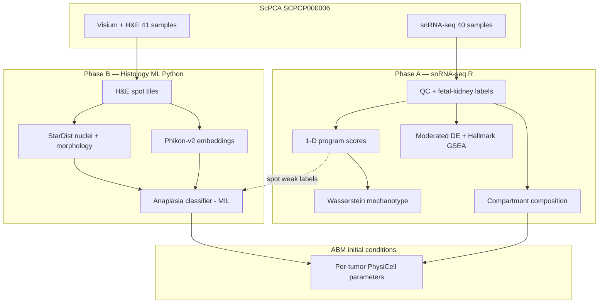

**Reproducibility:** All stochastic steps use seed `42` (logged). Intermediates live in `data/processed/`; headline outputs in `results/`.

---

## Data & cohort

| Modality | Count | Use |
|----------|-------|-----|
| snRNA-seq (nucleus) | 40 samples | Phase A mechanotypes |
| Visium spots + H&E | 41 samples | Phase B morphology ML |
| Bulk RNA-seq | 45 samples | Optional validation (not wired) |

**Histology:** 23 favorable / 22 anaplastic (`subdiagnosis` in ScPCA metadata).

**Access:**
- **Metadata (no token):** `python scripts/fetch_scpca_metadata.py`
- **API download:** `ScPCAr` R package ([docs](https://alexslemonade.github.io/ScPCAr/))
- **Manual download (recommended on Windows):** Portal zips → `scripts/ingest_manual_downloads.ps1`

Raw data are **never committed**; provenance logged in `data/raw/scpca_access_log.txt`.

---

## Phase A — Mechanotypes (snRNA-seq)

### Methodology

| Step | Script | Method |
|------|--------|--------|
| Ingest | `scripts/ingest_manual_scpca.R` | Load merged SCE; join `subdiagnosis` histology |
| QC + labels | `02_qc_normalize.R` | ≥200 genes/cell; assign compartments from **fetal-kidney signatures** (CM/UB/PV/fibroblast, `config/cell_signatures.yaml`) on tumor cells — gene-wise z-scored module scores + top-vs-runner-up margin gate |
| Scores | `03_compute_scores.R` | **Fixed** gene programs (`config/features.yaml`): log1p(CPM<sub>pos</sub>) − log1p(CPM<sub>neg</sub>) via `gene_symbol` |
| Items | `04_wasserstein_matrix.R` | Groups = (compartment × histology); **≥25 cells** rule |
| Distance | `04_wasserstein_matrix.R` | **1-D Wasserstein-1 only** on score distributions (`transport` package) |
| Clustering | `05_consensus_cluster.R` | ConsensusClusterPlus PAM; k via low **PAC** + high **Calinski–Harabasz** |
| Decomposition | `06_wasserstein_decompose.R` | location/size/shape split of W1 (Schefzik decomposition, base R), joined to patient-level FDR |
| Switches | `07_mechanotype_switches.R` | Flag compartment if cluster assignment differs favorable vs anaplastic |
| Composition | `12_composition_analysis.R` | Per-sample compartment fractions; CLR-Wilcoxon, patient-level, BH-FDR |
| Moderated DE | `14_moderated_de.R` | Pseudobulk **edgeR-QLF** + **limma-voom**, histology & relapse axes |
| Pathway GSEA | `15_hallmark_gsea.R` | **fgsea** preranked on the limma-voom moderated *t*, 50 MSigDB Hallmark sets |
| Prognostics | `16_prognostic_association.R` | **Firth** logistic + Fisher of composition/proliferation vs relapse; bootstrap/profile CI |
| Figures | `08_figures.R`, `18_result_figures.py` | W1/switch heatmaps, score violins, PAC/CHI, GSEA + DE summary |

Methods log: `results/mechanotypes/phase_a_methods.yaml`

### Key design choices

- **No feature fishing:** the program list is predefined before clustering (blastemal, epithelial, stromal, proliferation, WT1, Wnt/β-catenin); sensitivity to it is reported rather than tuned.
- **Compartment labels from fetal-kidney biology:** reference/`cellassign` annotations call WT tumor cells "hemangioblast/trophoblast/Unknown" and cannot separate the three compartments, so compartments are assigned from **fetal-kidney developmental signatures** on tumor cells (z-scored module scores + margin gate).
- **Patient is the unit of inference:** histology/relapse contrasts are tested across the ~40 samples, never across cells (cell-level testing is pseudoreplication and inflates significance).
- **1-D Wasserstein only:** multivariate Wasserstein on gene matrices underperforms on scRNA-seq (lab benchmark); W1 runs only on the predefined 1-D scores.
- **Match the instrument to the biology:** the same data is interrogated by distributional, compositional, single-gene DE, and pathway tests — and the signal is reported wherever it actually lives (composition + pathway here), with method-robust negatives reported as negatives.

### Phase A results — approaches in sequence

Compartments are assigned from **fetal-kidney developmental signatures** on tumor cells; all
inference is **patient-level** (labels contrasted across the ~40 samples, never across cells),
with BH-FDR within each analysis. Five lenses were applied in order; the signal surfaces in the
last four.

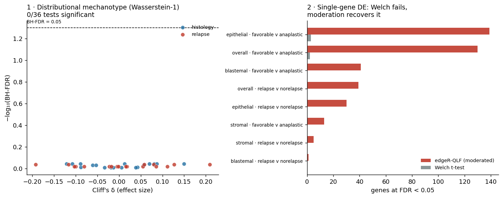

**1 · Distributional mechanotype (Wasserstein-1) — negative.** Rather than compare means, the
mechanotype lens compares the **whole distribution** of a program's activity: for two 1-D score
distributions the **Wasserstein-1 (earth-mover's) distance** is the area between their cumulative
distributions — the minimum "work" to reshape one into the other — so it sees shifts in location,
spread, and shape a difference-in-means misses. Each program's pairwise W1 matrix over
(compartment × histology) groups is consensus-clustered into "mechanotypes" (a compartment
*switches* if its class differs favorable vs anaplastic); W1 runs **only on the predefined 1-D
scores** (multivariate W1 is unstable on scRNA-seq). *Result:* with valid labels and patient-level
stats, **no** compartment shifts its within-compartment distribution (0/36 tests at BH-FDR; figure,
left). The machinery is sound — the phenomenon isn't there, which redirects to *where* it is.

*Decomposing what little distance there is* (`06_wasserstein_decompose.R`): the closed-form
location/size/shape split of the 2-Wasserstein distance (the Schefzik et al. decomposition that
`waddR` implements — computed directly in base R, as `waddR` has no current Bioconductor binary)
shows the distances are **small (W₁ ≈ 0.04–0.25) and shape-dominated**, not driven by a mean shift —
and, again, **0/18 are patient-level significant**. So even the *form* of the (non-)difference is
not a clean location shift.

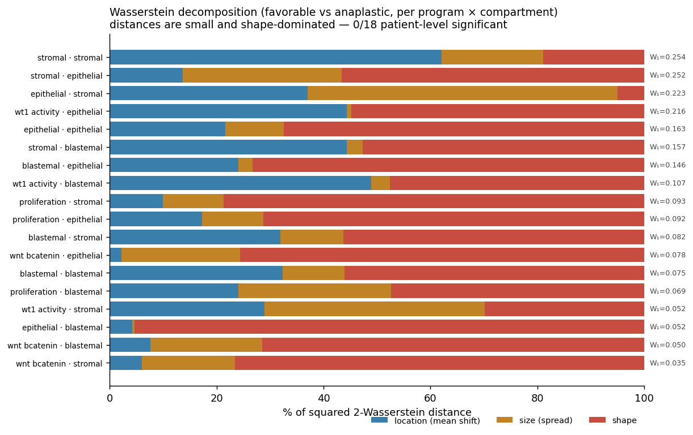

**2 · Compartment composition — positive.** The *relative abundance* of compartments differs by
histology: epithelial fraction ↑ in anaplastic (0.59 vs 0.44, BH-p=0.004), PV/mature-epithelial
subgroup ↑ in anaplastic (BH-p=0.005), stromal ↑ in favorable (BH-p=0.038). The histology signal
lives in composition, not in distribution shape.

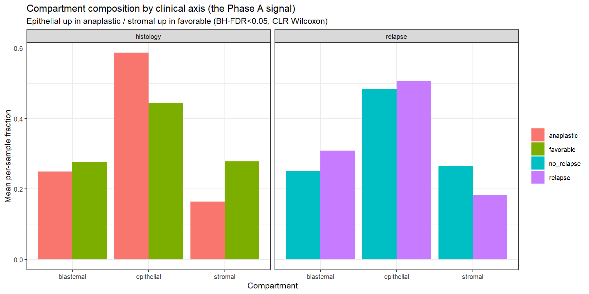

*What it shows.* Mean per-sample compartment fraction, split by the two clinical axes.
*What it measures.* Each patient contributes one fraction vector; bars are group means, tested
patient-level with a CLR-Wilcoxon (BH-FDR). *Result.* **Histology (left):** epithelial fraction is
higher in anaplastic (0.59 vs 0.44) and stromal is higher in favorable — the histology signal is
compositional. **Relapse (right):** composition barely moves, consistent with the relapse signal
living in a proliferation *program* (below) rather than in compartment proportions.

**3 · Single-gene differential expression — Welch fails, moderation recovers.** A Welch t-test on
pseudobulk finds ~0 genes at FDR<0.05 (underpowered at n≈20/group; figure, right). Empirical-Bayes
moderation (**edgeR-QLF / limma-voom**, `14_moderated_de.R`) recovers **130 genes FDR<0.05** for
histology (NOTCH2, PODXL, PTPRO, DACT3) and 39 for relapse.

**4 · Pathway enrichment — positive.** Full Hallmark GSEA (`15_hallmark_gsea.R`, fgsea on the
moderated *t*) gives **166 significant pathway-contrasts**; on the relapse axis **E2F_TARGETS
(q=9e-29)**, **G2M_CHECKPOINT**, **MYC_TARGETS** are up, replicated in the epithelial (q=4e-28) and
stromal (q=6e-30) compartments.


**5 · Prognostic association — nominal.** A pseudobulk proliferation score predicts relapse (Firth
OR≈4/SD, p=0.013; Fisher OR 7.6, p=0.017; `16_prognostic_association.R`) — reported as nominal
(doesn't survive BH-FDR or covariate adjustment; OS unmodelable, `vital_status` has 5 deaths).

**Convergence.** The relapse axis — higher cell-cycle/E2F/G2M/MYC activity — is recovered
independently by gene-level DE, pathway GSEA, and patient-level prognostics, and matches the
literature ([Yang 2025](https://www.frontiersin.org/journals/immunology/articles/10.3389/fimmu.2025.1539897/full); TP53/anaplasia).

Details: `composition_analysis.csv`, `distributional_validation*.csv`, `moderated_de.csv`, `hallmark_gsea.csv`, `prognostic_association.csv`

---

## Phase B — Histology ML (Visium H&E)

### Methodology

| Step | Script | Method |
|------|--------|--------|
| Tiles | `01_extract_tiles.py` | Visium hires H&E patches centered on tissue spots; **Macenko** stain norm (ref `SCPCL000438`) |
| Programs | (in 01) | Same Phase A gene scores on spot RNA → dominant state + softmax fractions |
| Segment | `02_segment_nuclei.py` | **StarDist** `2D_versatile_he` (learned H&E nuclei model) |
| Features | `03_nucleus_features.py` | Area, eccentricity, solidity, texture, H-intensity, neighbor density |
| Embeddings | `15_phase_b_mil.py` | **Phikon-v2** (ViT-L, 1024-d) tile embeddings, 200 spots/tumor |
| Classifier | `14`/`15_phase_b_mil.py` | Histology (anaplasia) from embeddings — mean-pool + **attention-MIL**, leave-one-tumor-out |
| Morphology | `16_stardist_morphology.py` | Per-tumor nuclear-atypia features (giant-nucleus fraction, pleomorphism) → RF; embedding ensemble |
| Composition | `12_spot_composition_regression.py`, `13_fm_embedding_regression.py` | Cross-modal LOTO regression: predict per-spot compartment fractions from morphology / FM embeddings (negative, with shuffled + random controls) |
| Stats | `phase_b_stats.py` | **DeLong** AUC CIs, label-permutation p, paired DeLong |
| ABM | `06`/`17_positives_to_abm.py` | Map composition + proliferation + anaplasia → per-tumor PhysiCell parameters |
| Figures | `07_figures.py`, `18_result_figures.py` | Deconv scatter, AUC forest, ABM parameter panels |

Methods log: `results/classifier/phase_b_methods.json` · Config: `config/phase_b.yaml`

### Phase B results — approaches in sequence

Full cohort: **41 tumors, ~260k Visium spots, H&E at hires resolution.** Everything is held out
**leave-one-tumor-out**, with DeLong 95% CIs and label-permutation p.

**1 · H&E → continuous compartment composition — negative.** The first question was whether
aggregated morphology predicts the per-spot transcriptomic compartment *fractions* (the cheap
proxy the ABM would ideally use). It does not: leave-one-tumor-out Pearson *r* ≈ 0 for both
hand-crafted nucleus features and Phikon embeddings — indistinguishable from shuffled-target and
random-feature controls.

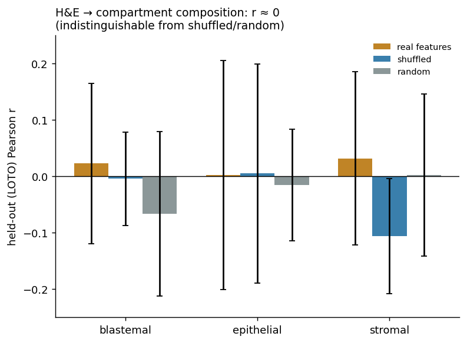

**2 · Nuclear morphology → anaplasia.** Unfavorable histology is *defined* by nuclear atypia
([Vujanić 2024](https://onlinelibrary.wiley.com/doi/full/10.1002/pbc.31000)), so the next target is histology itself. Classical **watershed**
segmentation → morphology features fails (AUC **0.39**, worse than chance); the learned **StarDist**
`2D_versatile_he` model lifts the same pipeline to **0.687** (p=0.021). Segmentation, not the
hypothesis, was the bottleneck.

**3 · Foundation-model embeddings → anaplasia — the positive.** Phikon-v2 tile embeddings classify
anaplastic vs favorable at the tumor level: mean-pool **0.733**, attention-MIL **0.748** (perm
p=0.003).

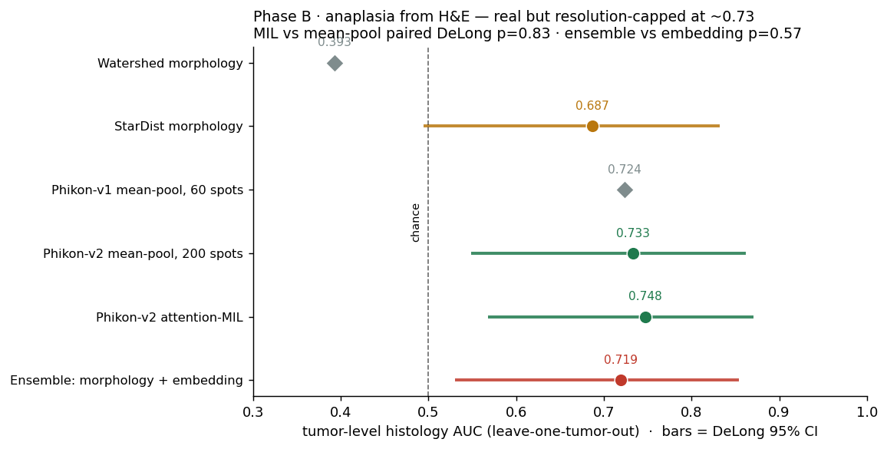

| Model | AUC | 95% CI (DeLong) | perm p |
|-------|-----|-----------------|--------|
| **Phikon-v2 embeddings, attention-MIL** | **0.748** | [0.57, 0.87] | 0.003 |
| Phikon-v2 embeddings, mean-pool | 0.733 | [0.55, 0.86] | 0.006 |
| StarDist nuclear morphology | 0.687 | [0.50, 0.83] | 0.021 |
| Ensemble (morphology + embedding) | 0.719 | [0.53, 0.85] | 0.009 |

**4 · Pushing the ceiling — no further gain.** Scaling spots 60→200, the ViT-L encoder, and
attention-MIL move AUC only 0.724→0.748, and MIL is indistinguishable from flat mean-pooling
(paired DeLong p=0.83); a morphology+embedding **ensemble** does not beat the embedding alone
(p=0.57). The ~0.73 plateau is a **Visium-hires resolution ceiling** (median ~14 segmentable
nuclei/tumor), not a modeling gap.

**Conclusion.** H&E robustly reads **anaplasia** — the tumor's growth *regime* — but not continuous
compartment composition. So for the ABM, H&E sets the regime while compartment fractions come from
the transcriptomic deconvolution.

Details: `fm_embedding_regression_phikon.json`, `stardist_morphology.json`, `phase_b_mil_phikon-v2.json`

### Phase B extension — viable-blastemal vs necrotic/regressive tissue

A follow-up pilot (`19`–`25`) asks whether H&E gives the **ratio** and **spatial position** of
*regressive* (necrotic/therapy-changed) tissue, reusing the same tiles / Phikon-v2 embeddings /
StarDist. A weak regressive label (per-spot low-UMI **and** depleted viable-program) is validated
against independent necrosis QC (mitochondrial fraction, genes-detected) and audited hard
(bootstrap CI, permutation, quality-confound control, model/rank robustness, threshold sweep).

| Question | Result |
|----------|--------|
| **Ratio** — per-tumor necrosis burden from H&E | **Yes.** Mean Phikon-v2 embedding → per-tumor mean mito% (an independent necrosis readout), LOTO **Pearson r=0.56, 95% CI [0.36, 0.81]**; survives a tissue-quality confound control (partial *r*=0.55), model-consistent (Ridge≈RF), pathology-specific (Phikon 0.34 vs generic ResNet 0.19). |
| **Positions** — spatial map | Regression forms coherent tissue territories (interior-only neighbourhood z≈7.9); a SpotSweeper-style local-outlier QC flags only ~7% of the label as isolated technical dropout. |
| **Positions from the image** — per-spot | **No.** Balanced LOTO AUC ≈0.52 (chance) — a Visium-hires resolution ceiling; needs whole-slide images. |
| **Full SIOP regression** (necrosis + fibrosis + xanthomatous) | Necrosis is only ~10% of total regression (necrosis 2% / fibrotic 7% / xanthomatous 12% / broad 21%), but the cellular forms conflate with native stroma/TAMs by signature alone → needs pathology annotation (a *demonstrated* ask, not a solved measurement). |

Cohort caveat: only **11/38** spatial tumors are post-chemotherapy (10 anaplastic), so the
treatment axis is confounded. Scripts: `19` pilot · `20` regressive-balanced re-embed · `21` rigor
· `22` audit · `23` generic-CNN ablation · `24` quality-confound control on the necrosis target ·
`25` SpotSweeper-style de-speckle + fibrosis/macrophage broadening.

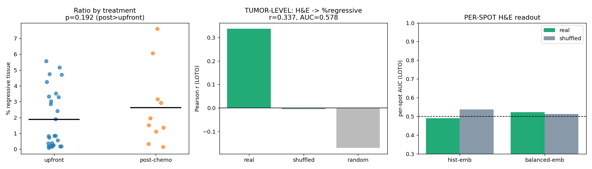

*What it shows / measures / result.* **Left** — per-tumor % regressive tissue, upfront vs
post-chemotherapy: post-chemo trends higher (as expected for therapy-induced regression) but
weakly (Mann-Whitney p=0.19) and confounded (10/11 post-chemo tumors are anaplastic). **Middle** —
tumor-level H&E readout: mean Phikon-v2 embedding → % regressive, held-out Pearson *r* against
shuffled-label and random-feature null controls (real signal sits above both nulls). **Right** —
per-spot H&E readout AUC: at chance, the resolution ceiling. *(This figure shows the low-UMI
label-fraction target; the audit's robust headline — H&E → mean mitochondrial fraction,
**r=0.56, CI [0.36, 0.81]** — is in the result JSONs.)*

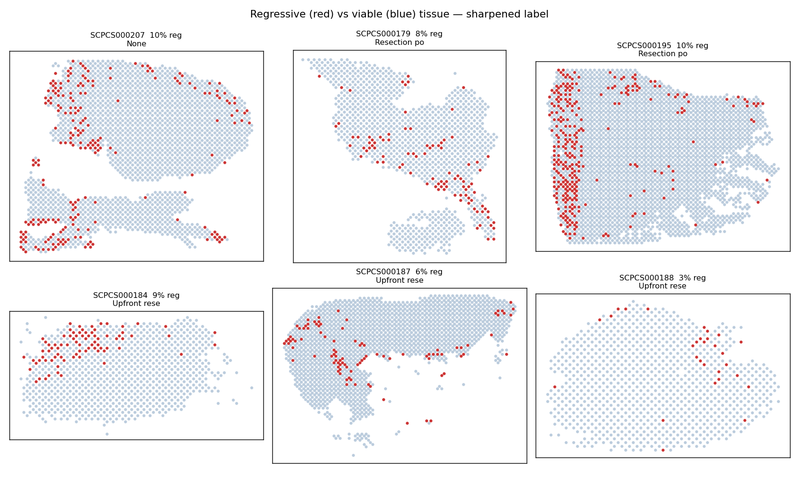

*What it shows / measures / result.* The six tumors with the most regressive tissue; every Visium
spot at its array coordinate, coloured **regressive (red)** vs **viable (blue)**. Regression forms
coherent contiguous territories — rim/margin bands and geographic patches, not scattered noise —
which the rigor pass confirmed is ~93% genuine (only ~7% isolated technical dropout; interior-only
neighbourhood clustering z≈7.9).

**Bottom line:** H&E gives a real, modest, pathology-specific **necrosis-burden ratio** and a
**spatial map** now; per-spot localization and full-regression specificity are externally gated
(whole-slide images; pathology annotation).

---

## Results summary

| Finding | Result |
|---------|--------|
| **Composition shifts by histology** | Epithelial ↑ anaplastic, stromal ↑ favorable — BH-FDR<0.05 (CLR-Wilcoxon) |
| **Proliferation program marks relapse** | E2F/G2M/MYC GSEA q≈1e-29; edgeR-QLF 130 DE genes FDR<0.05; proliferation score → relapse (Firth p=0.013) |
| **Within-compartment distributions** | No shift (0/18 BH-FDR) — histology lives in composition, not distribution |
| **H&E predicts anaplasia** | Tumor-level AUC **0.748** (attention-MIL), perm p=0.003; StarDist morphology 0.687 (p=0.021) |
| **H&E predicts continuous composition** | No — LOTO *r*≈0 (FM + hand-crafted); H&E sets growth regime, not fine composition |
| **ABM initial conditions** | Per-tumor PhysiCell parameters from composition + proliferation + anaplasia |
| **Coupled levers (Phase C)** | 4 FDR-robust couplings (prolif⊣crowding, blastemal⊣EMT, Wnt→EMT, p53→crowding) → bounded, correlated ranges for the PhysiCell virtual-cohort sweep |
| **Bulk vs spatial (Phase C)** | Bulk recovers proliferation–crowding + program expression; EMT couplings and cell-type fractions need spatial resolution |
| **Survival (Phase C)** | TARGET-WT OS (n=125): 0/9 levers survive FDR; blastemal→worse / p53→better trends |
| Reproducible repo | Pinned env, numbered scripts, config-driven paths, DeLong/permutation/Firth/bootstrap stats, unit tests |

---

## ABM initial conditions (PhysiCell)

The Phase A/B findings translate directly into per-tumor agent-based-model inputs
([`17_positives_to_abm.py`](phase2_histology_ml/17_positives_to_abm.py) →
[`results/abm/positives_to_physicell.yaml`](results/abm/positives_to_physicell.yaml)):

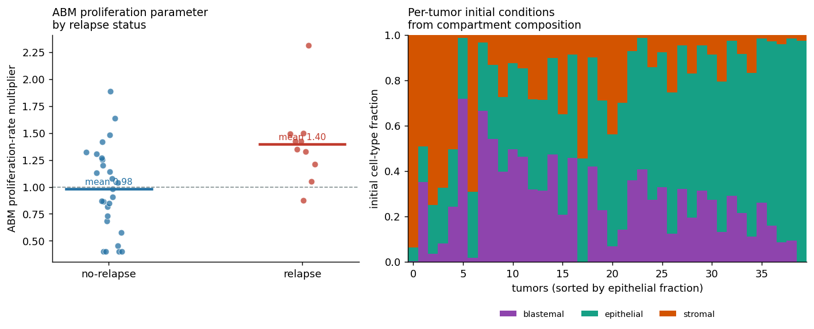

| Finding | PhysiCell parameter |
|---------|---------------------|
| Compartment composition | **initial cell-type fractions** (right panel) |
| Proliferation score | **proliferation_rate** multiplier, bounded `1 + 0.6·z` |
| p53-target activity | **apoptosis_rate** multiplier |
| H&E anaplasia probability | **high-grade regime** (extra proliferation, reduced adhesion) |

The mapping encodes the measured biology rather than being fit to outcome: as a check, the
proliferation multiplier averages **1.40 in relapse vs 0.98 in non-relapse** (left panel). This
gives PhysiCell spatially-resolved, biologically-grounded starting conditions per tumor rather than
a uniform configuration. Running the simulation itself requires the PhysiCell binary (cluster).

---

## Phase C — Coupled levers & resolution-bounded seeding

Phase A/B produce per-tumor point estimates; the ABM instead needs **rules** (which intrinsic
programs move which microenvironment axes) plus **bounded, correlated ranges** to sweep — not a
single "best" parameter set. Phase C builds that coupled prior from the omics, tests whether cheap
**bulk** RNA-seq can replace expensive spatial resolution, and characterises the tumor **shapes** to
seed. Every lever uses a **disjoint** gene panel ([`config/levers.yaml`](config/levers.yaml),
machine-checked by [`coupling_geneset_audit.py`](phase1_mechanotypes/coupling_geneset_audit.py)) so
couplings are biological, not gene-sharing artifacts.

### Methodology
- **Levers & axes** — 6 intrinsic levers (proliferation, p53-target, canonical-Wnt, blastemal-
  nephrogenic, IGF, EMT) + 2 extrinsic axes (crowding, hypoxia), scored per cell and per tumor.
- **Coupling network** — tumor-level **partial** correlations with bootstrap CIs + BH-FDR
  (`coupling_core.R`, shared `couplings_lib.R`); cell-level run as a secondary check.
- **Bifurcation** — bimodality coefficient + 2-component GMM/BIC per lever (`19_bifurcation_transfer.R`).
- **Transfer** — standardized `axis ~ levers` regressions with bootstrap CIs → `config/joint_priors.yaml`.
- **Bulk resolution ladder** — the *same* network on bulk RNA-seq (`20_bulk_coupling.R`) + NNLS
  reference deconvolution (`25_bulk_deconv.R`) vs the paired single-cell composition.
- **Cohort-wide FDR** — `23_global_fdr.R` pools all 68 tests across families (no cherry-picking).
- **Survival** — TARGET-WT **open** GDC data (`target_wt_pull.py`), OS Cox on binary levers (`27_...R`).
- **Architecture** — Visium compartment maps → nodule geometry / spatial autocorrelation (`26_tissue_architecture.py`).
- **Seeding sweep** — `05_uq.py --mode virtual_cohort` draws correlated synthetic tumors from the prior.

### Phase C results — approaches in sequence

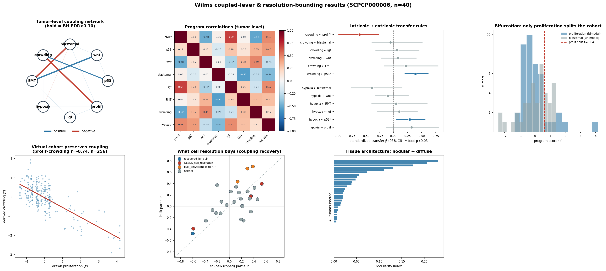

**1 · Coupling network — which levers move together.** Tumor-level **partial** correlations (conditioning
on all other levers) with bootstrap CIs and BH-FDR isolate *direct* associations. Four couplings survive
FDR — **proliferation ⊣ crowding (−0.60)**, **blastemal ⊣ EMT (−0.59)**, **Wnt → EMT (+0.53)**,
**p53 → crowding (+0.35)** — and all four also clear a **cohort-wide** global FDR pooling 68 tests across
families (`23_global_fdr.R`). Partial correlation correctly *deflates* spurious marginal edges (e.g.
proliferation↔IGF 0.69 → 0.38, n.s.). The hypothesised p53×EMT is **not** supported — p53 partners
crowding, EMT partners Wnt/blastemal. The same network at the **cell** level is near-null (|r|<0.05), so
the couplings are a **between-tumor** property and the seeding Σ is built at the tumor level.

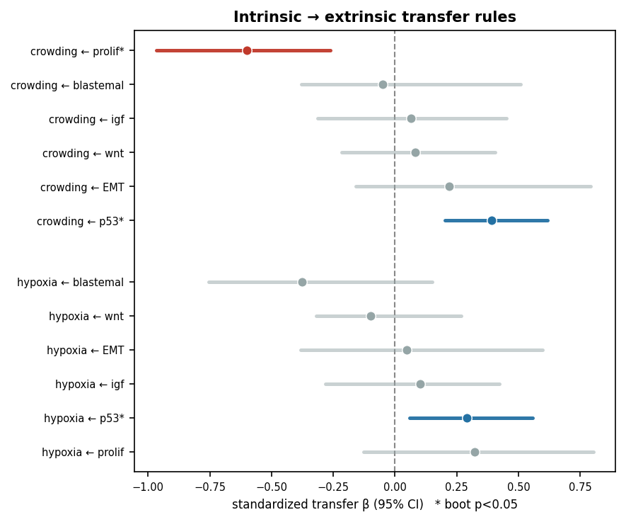

**2 · Intrinsic → extrinsic transfer.** Standardized `axis ~ levers` regressions (bootstrap CIs) give the
seeding *rules*: **crowding ← proliferation (−0.60) / p53 (+0.39)** and **hypoxia ← p53 (+0.29)**; the
other nine coefficients cross zero. These measured slopes supersede the hand-set `k` scalars in the
per-tumor mapping.

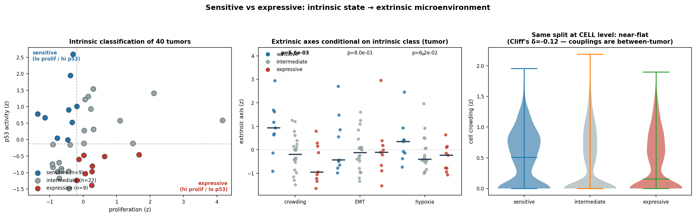

**3 · Sensitive vs expressive.** Labelling tumors by intrinsic state — **expressive** (aggressive:
hi-proliferation / lo-p53) vs **sensitive** (restrained) — the extrinsic axes separate as the transfer
predicts: crowding **−0.57 in expressive vs +0.96 in sensitive** (Mann–Whitney p=0.006, Cliff's δ=−0.75);
EMT does not differ (it is Wnt/blastemal-driven). The same split at the cell level is flat (δ=−0.12),
reconfirming the between-tumor nature.

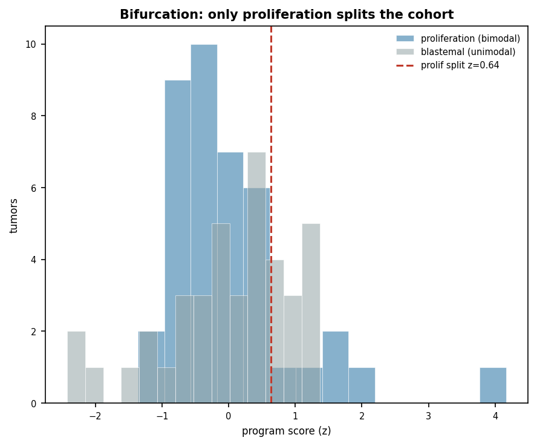

**4 · Bifurcation.** Bimodality coefficient + 2-component GMM/BIC per lever: **only proliferation** splits
the cohort into two modes (~16% high-proliferation); the rest are unimodal. The virtual-cohort draw uses
each lever's *empirical* marginal, so this bimodality is honoured automatically.

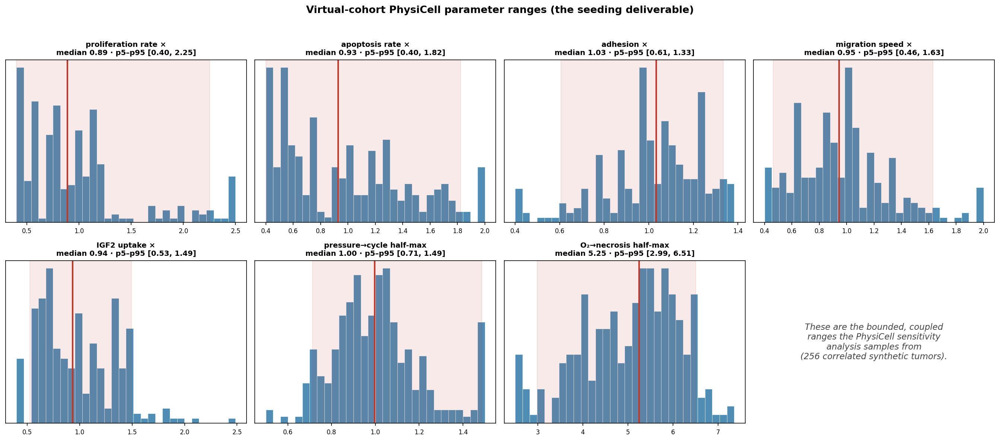

**5 · The deliverable — bounded, coupled ranges.** `05_uq.py --mode virtual_cohort` draws 256 correlated
synthetic tumors from the prior (Gaussian copula on the levers' joint distribution) and pushes them
through the transfer to PhysiCell parameters. The result is a **bounded range per parameter** (e.g.
proliferation ×0.40–2.25, pressure→cycle half-max 0.71–1.49, O₂→necrosis 2.99–6.51) that *preserves the
couplings* (drawn proliferation vs derived crowding r=−0.74) — the "ranges for sensitivity analysis," not
a best-fit point.

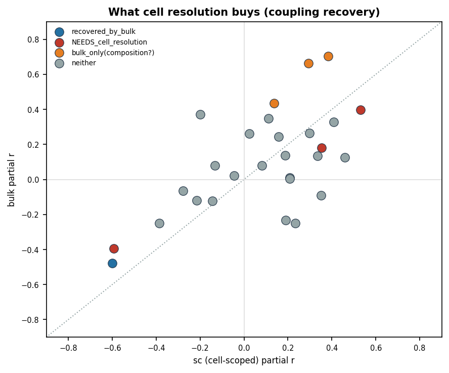

**6 · Bulk vs spatial — can cheap data replace expensive resolution?** The *same* network on **bulk**
RNA-seq (same 40 tumors): bulk **recovers** proliferation ⊣ crowding and program *expression* (concordance
r 0.7–0.8), but the **EMT couplings need cell resolution** (bulk cannot tumor-scope EMT away from stromal
VIM) and bulk **invents** composition-driven artifacts that within-cell partial correlation dissolves.
NNLS deconvolution recovers the *ordering* of compartment fractions (r≈0.5) but is absolutely biased
(Lin's CCC 0.18–0.48, stromal-overcalled) — so cell-type *fractions* are where spatial earns its keep.

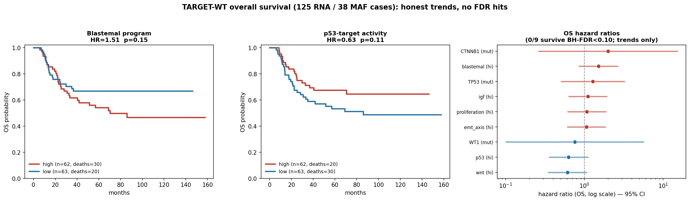

**7 · Survival (lever validation, not prognosis).** The **open-access** TARGET-WT GDC cohort (125 RNA /
38 MAF cases, 113 OS events) — pulled without dbGaP — gives OS Cox on the binary levers. **0/9 survive
BH-FDR**, but the trends are biologically coherent: **blastemal → worse** (HR 1.5), **p53-activity →
better** (HR 0.63), mutation levers underpowered. Per the no-fitting-to-outcome rule, survival is reported
only; it never re-weights the sweep.

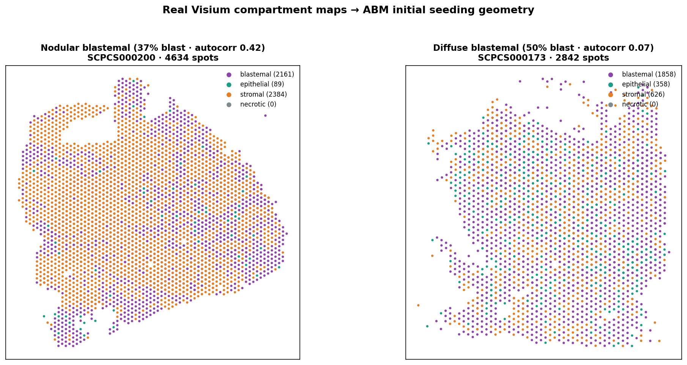

**8 · Histology → shape → seeding.** Visium compartment maps give per-tumor architecture (nodule geometry,
spatial autocorrelation): tumors span **nodular** (blastemal in discrete territories) to **diffuse**
(blastemal intermixed) at matched composition — the initial geometries to seed the ABM. A clustered
[per-tumor lever heatmap](results/figures/phase_c_lever_heatmap.png) shows the intrinsic profiles do
**not** cleanly separate favorable from anaplastic (consistent with the ~0.73-AUC ceiling) — an honest
negative on "clustering by histology."

**Deliverable:** [`config/joint_priors.yaml`](config/joint_priors.yaml) — bounded lever ranges + couplings
+ transfer, consumed by the correlated virtual-cohort sweep.

---

## Figure gallery

Regenerate all figures:

```powershell
scripts\run_figures.bat
```

| Figure | Description |
|--------|-------------|
| [`phase_a_w1_heatmaps.png`](results/figures/phase_a_w1_heatmaps.png) | Pairwise W1 distances per feature program |
| [`phase_a_mechanotype_switch_heatmap.png`](results/figures/phase_a_mechanotype_switch_heatmap.png) | Switches favorable ↔ anaplastic by compartment |
| [`phase_a_score_distributions.png`](results/figures/phase_a_score_distributions.png) | WT1, blastemal, proliferation score violins |
| [`phase_a_consensus_metrics.png`](results/figures/phase_a_consensus_metrics.png) | PAC & CHI vs k for consensus clustering |
| [`phase_b_deconv_validation.png`](results/figures/phase_b_deconv_validation.png) | H&E vs RNA spot fractions (3 compartments) |
| [`phase_b_dominant_state_confusion.png`](results/figures/phase_b_dominant_state_confusion.png) | Dominant compartment agreement matrix |
| [`phase_b_fractions_by_histology.png`](results/figures/phase_b_fractions_by_histology.png) | Composition by favorable vs anaplastic |
| [`phase_b_segmentation_mosaic.png`](results/figures/phase_b_segmentation_mosaic.png) | Segmentation QC on sample tiles |
| [`phase_b_classifier_summary.png`](results/figures/phase_b_classifier_summary.png) | Accuracy metrics + correlation bar chart |
| [`mechanotype_switches.png`](results/figures/mechanotype_switches.png) | Bar chart of switches (from script 07) |
| [`phase_a_gsea_de.png`](results/figures/phase_a_gsea_de.png) | Hallmark GSEA (relapse axis) + moderated-DE FDR gene counts |
| [`phase_b_histology_auc.png`](results/figures/phase_b_histology_auc.png) | Histology AUC forest with DeLong 95% CIs (watershed→StarDist→Phikon→MIL→ensemble) |
| [`phase_a_negatives.png`](results/figures/phase_a_negatives.png) | Phase A negatives: distributional mechanotype (0/36) + Welch-vs-moderated DE |
| [`wasserstein_decomposition.png`](results/figures/wasserstein_decomposition.png) | W1 location/size/shape decomposition per program × compartment |
| [`phase_b_composition_negative.png`](results/figures/phase_b_composition_negative.png) | Phase B negative: H&E → compartment composition (LOTO *r*≈0 vs controls) |
| [`abm_parameters.png`](results/figures/abm_parameters.png) | ABM proliferation multiplier by relapse + per-tumor initial fractions |
| [`regressive_pilot_summary.png`](results/figures/regressive_pilot_summary.png) | Regressive extension: ratio by treatment + tumor-level H&E→necrosis (r) + per-spot readout |
| [`regressive_pilot_spatialmaps.png`](results/figures/regressive_pilot_spatialmaps.png) | Regressive extension: spatial maps of regressive (red) vs viable (blue) tissue |
| [`phase_c_dashboard.png`](results/figures/phase_c_dashboard.png) | Phase C dashboard: coupling network, correlation heatmap, transfer forest, bifurcation, virtual cohort, bulk-vs-spatial recovery, architecture (7 panels also saved standalone as `phase_c_network/heatmap/forest/…`) |
| [`phase_c_forest.png`](results/figures/phase_c_forest.png) | Intrinsic → extrinsic transfer coefficients with bootstrap CIs |
| [`phase_c_sensitive_expressive.png`](results/figures/phase_c_sensitive_expressive.png) | Intrinsic (prolif/p53) → sensitive/expressive classes → conditional extrinsic axes (tumor + cell level) |
| [`phase_c_survival.png`](results/figures/phase_c_survival.png) | TARGET-WT OS: Kaplan–Meier (blastemal, p53) + hazard-ratio forest of all 9 levers |
| [`phase_c_virtual_cohort_ranges.png`](results/figures/phase_c_virtual_cohort_ranges.png) | The bounded PhysiCell parameter ranges the sensitivity sweep samples (median + p5–p95) |
| [`phase_c_tissue_maps.png`](results/figures/phase_c_tissue_maps.png) | Real Visium compartment maps: nodular vs diffuse blastemal → ABM seeding geometry |
| [`phase_c_lever_heatmap.png`](results/figures/phase_c_lever_heatmap.png) | 40 tumors × 8 levers, ward-clustered, annotated by favorable/anaplastic |
| [`phase_c_abm_*.png`](results/figures/) | ABM deck figures: placement, omics→params, half-max knob, cohort heatmap |

Phase A/B figures regenerate with `08_figures.R` + `python phase2_histology_ml/18_result_figures.py`.
Phase C figures regenerate with `python phase1_mechanotypes/{21_coupling_figures,28_more_figures}.py`.
Segmentation overlays: `data/processed/nuclei/overlays/`

---

## Quick start

### 1. Environment

```powershell
# Python deps (Phase B): core + Phikon embeddings + StarDist/TensorFlow
pip install -r requirements.txt
#   core    : scanpy scikit-learn scikit-image opencv-python-headless pyarrow scipy matplotlib seaborn
#   FM/MIL  : torch torchvision transformers
#   segment : tensorflow-cpu stardist csbdeep

# R 4.x + packages (Phase A): mechanotype, edgeR/limma, fgsea/msigdbr, logistf
winget install RProject.R
scripts\rscript.bat scripts\install_r_packages.R
scripts\rscript.bat scripts\scpca_auth.R   # optional for API download
```

Or: `conda env create -f environment.yml && conda activate sc-wilms-data`

> **Windows note:** StarDist's `2D_versatile_he` model loads via a directory *junction*
> (created automatically; avoids the admin requirement of a symlink). `edgeR/limma/fgsea/
> msigdbr` install as Bioconductor binaries; `waddR` is not required (the W1 decomposition is
> computed in base R).

### 2. Metadata (no download)

```powershell
python scripts/fetch_scpca_metadata.py
```

### 3. Manual data ingest (recommended)

Place Portal zips in Downloads, then:

```powershell
powershell -File scripts/ingest_manual_downloads.ps1
scripts\rscript.bat scripts\ingest_manual_scpca.R
```

### 4. Run pipelines

```powershell
# Phase A: QC → mechanotypes → figures
scripts\run_phase_a.bat

# Phase B: requires spaceranger extract; sets WILMS_DEMO=0
scripts\run_phase_b.bat

# Figures only
scripts\run_figures.bat
```

### 5. Tests

```powershell
pytest -q
scripts\rscript.bat -e "testthat::test_dir('tests', filter = 'phase1')"
```

---

## Repository layout

```
sc-wilms-data/
├── config/                  # paths.yaml, features.yaml, phase_b.yaml, physicell.yaml, levers.yaml, joint_priors.yaml
├── phase1_mechanotypes/     # R: 00–28 (mechanotype, DE, GSEA, prognostics; 18–28 + coupling_*/couplings_lib/target_wt_* = Phase C coupled levers)
├── phase2_histology_ml/     # Python: 00–26 numbered scripts (tiles, embeddings, MIL, StarDist, ABM, figures; 19–25 = regressive pilot, 26 = tissue architecture)
├── phase3_abm/              # Python: PhysiCell authoring (place agents, emit rules, build model, UQ sweep incl. virtual_cohort)
├── scripts/                 # ingest, run_phase_*.bat, fetch metadata
├── data/raw/                # gitignored ScPCA + TARGET-WT downloads
├── data/processed/          # gitignored intermediates (SCE, scores, tiles, nuclei, embeddings)
├── results/                 # mostly gitignored (results/figures/ is tracked)
│   ├── mechanotypes/        # composition, moderated DE, GSEA, prognostics CSVs; consensus RDS
│   ├── classifier/          # histology AUC + MIL/StarDist JSON, deconv/composition JSON
│   ├── couplings/           # Phase C: coupling network, transfer, bifurcation, bulk/, survival, global FDR
│   ├── spatial/             # Phase C: per-tumor tissue-architecture descriptors
│   ├── figures/             # analysis figures (PNG, flat; `phase_a_*` / `phase_b_*` / `phase_c_*`)
│   └── abm/                 # per-tumor PhysiCell parameters (YAML + CSV) + virtual_cohort/
├── tests/
├── PRD.md                   # requirements & acceptance criteria
├── AGENTS.md                # agent/human coding rules
└── .learnings/LEARNINGS.md  # accumulated gotchas
```

---

## Configuration

| File | Purpose |
|------|---------|
| `config/features.yaml` | **Fixed** Phase A gene programs, consensus params, seed |
| `config/paths.yaml` | All relative paths (no hard-coded absolutes) |
| `config/phase_b.yaml` | Visium tile size, library limits, segmentation, classifier |
| `config/physicell.yaml` | ABM domain and cell-type parameter mapping |
| `config/levers.yaml` | **Phase C** curated *disjoint* lever/axis gene panels (roles, `hippo_core`, EMT scope) |
| `config/joint_priors.yaml` | **Phase C** auto-generated coupled prior (lever ranges + couplings + transfer) for the sweep |

**Important:** Set `WILMS_DEMO=0` (or use `run_phase_b.bat`) for real Visium processing. `WILMS_DEMO=1` generates synthetic tiles for CI only.

---

## Limitations & next steps

1. **Compartment assignment** uses fetal-kidney signatures on tumor cells; validate against spatial/IHC ground truth where available.
2. **Phase A coverage:** only ~30% of nuclei map confidently to a compartment after the margin gate.
3. **Segmentation:** StarDist `2D_versatile_he` needs a Windows directory *junction* (not a symlink — avoids the admin requirement) to load.
4. **Wasserstein decomposition** (`06_wasserstein_decompose.R`): the location/size/shape split is descriptive of the (small, non-significant) within-compartment distances; it is not a significance test.
5. **PhysiCell:** initial-condition mapping is produced (`positives_to_physicell.yaml`); the simulation itself needs the PhysiCell binary on a cluster.

### Externally-gated extensions

Two ceilings are set by the available data, not by method, and need inputs beyond the local
ScPCA cohort to lift:

- **Phase B resolution.** Only Visium-**hires** tiles (~96 px/spot) are available, not the original
  whole-slide images — capping tumor-level anaplasia AUC near 0.73 and StarDist near ~14 nuclei/tumor.
  Lifting it needs the raw WSIs + a gated pathology foundation model (**UNI2 / Virchow2 /
  Prov-GigaPath**) or **XMAG** (5×-native), gated on an HF access token.
- **Time-to-event survival.** Local metadata is **binary** (`relapse_status`) with too few deaths
  (`vital_status`, n=5) for Cox / Kaplan-Meier. **Now done (Phase C):** the **open-access**
  **TARGET-WT** GDC cohort (125 RNA / 38 MAF cases, 113 OS events) was pulled and OS Cox run on the
  intrinsic levers — **0/9 survive BH-FDR**, with coherent trends (blastemal → worse HR 1.5,
  p53-activity → better HR 0.63). The raw dbGaP sequencing remains credential-gated but was not
  needed. Remaining external lift: a **Scissor** reproduction of the relapse-cell analysis.

### Status against the project goal

- **Which compartments shift transcriptional behavior?** Resolved: the shift is **compositional**
  (epithelial ↑ anaplastic, FDR<0.05) plus a **proliferation program on the relapse axis**
  (E2F/G2M/MYC q≈1e-29; 130 moderated-DE genes). Within-compartment program *distributions* do not
  shift — a clean negative that localizes the signal to composition.
- **Does H&E track composition well enough to seed the ABM?** H&E robustly reads **anaplasia**
  (AUC ~0.73, held out) — the prognostically decisive feature — but **not** continuous
  3-compartment composition (cross-tumor *r*≈0). H&E therefore sets the tumor's **growth regime**;
  fine composition comes from transcriptomic deconvolution. The ~0.73 is resolution-bound (above).
- **(3) — yes, as a mapping.** Per-tumor PhysiCell parameters are generated and pass a directional
  sanity check. What remains is **running PhysiCell itself** (the binary, on a cluster).
- **Can we seed with *coupled rules and bounded ranges* rather than best-fit params, and how far
  does cheap bulk get us? (Phase C)** Yes: 4 FDR-robust couplings + measured intrinsic→extrinsic
  transfer become a coupled prior (`joint_priors.yaml`) driving a correlated virtual-cohort sweep.
  Bulk recovers the proliferation–crowding backbone and program expression (r 0.7–0.8) but **needs
  spatial/single-cell** for the EMT couplings and for cell-type fractions — a clean bound on what
  resolution buys. Survival adds trends but no FDR hits.

**Bottom line:** the analysis half of the project is *complete and honestly characterized* for this
cohort — every locally-answerable question has an answer with effect sizes, CIs, and stated nulls,
now including the coupled-lever prior, the bulk-vs-spatial bound, and TARGET-WT survival. The one
open end is the **downstream PhysiCell simulation** (the binary, on a cluster) — not blocked by
missing analysis code.

---

## References & citation

- ScPCA Portal & `SCPCP000006`: [Alex's Lemonade ScPCA](https://scpca.alexslemonade.org/) · preprint [10.1101/2024.04.19.590243](https://doi.org/10.1101/2024.04.19.590243)
- ScPCAr R package: [GitHub](https://github.com/AlexsLemonade/ScPCAr)
- Wasserstein mechanotyping framework: Radhakrishnan lab pan-cancer mechanobiology work (W1 + ConsensusClusterPlus + n≥25 rule)
- waddR: 2-Wasserstein decomposition for scRNA-seq
- Visium: 10x Genomics spatial; Macenko stain normalization; StarDist H&E nuclei (`2D_versatile_he`)

**Lab context:** Multiscale intrinsic–extrinsic coupling (PhysiCell ABM) — see `PRD.md` appendix.

---

## ScPCAr API cheat sheet

| Task | Function | Auth? |
|------|----------|-------|
| List projects | `scpca_projects()` | No |
| Sample table | `get_project_samples("SCPCP000006")` | No |
| Agree to terms | `get_auth(email, agree=TRUE)` | — |
| Download merged SCE | `download_project(..., format="sce", merged=TRUE)` | Yes |
| Download Visium | `download_project(..., format="spatial")` | Yes |

**Deprecated:** `download_sample()` — use `create_dataset()` → `download_dataset(await_processing=TRUE)`.

See also [ScPCA download guide](https://scpca.readthedocs.io/en/stable/download_files.html).
