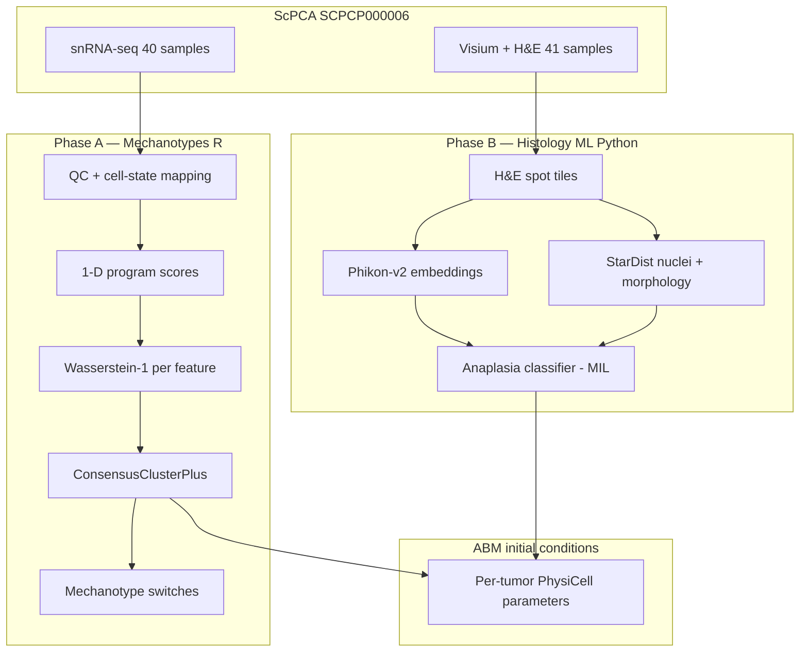

# sc-wilms-data

**Wilms tumor distributional mechanotypes + histology-informed spatial composition**

Computational pipeline connecting **Wasserstein mechanotyping framework** (Phase A) to **Visium H&E morphology ML** (Phase B) for the public ScPCA cohort [**SCPCP000006**](https://scpca.alexslemonade.org/projects/SCPCP000006) — paired snRNA-seq, Visium spatial transcriptomics, H&E images, and bulk RNA-seq from favorable and anaplastic Wilms tumors.

> **Scientific goal:** Identify how whole *distributions* of interpretable molecular programs differ across Wilms compartments and histology, then validate whether H&E-derived spatial cell-state composition agrees with transcriptomics — a prerequisite for morphology-informed agent-based models (PhysiCell).

---

## Table of contents

1. [Background](#background)
2. [Pipeline overview](#pipeline-overview)
3. [Data & cohort](#data--cohort)
4. [Phase A — Mechanotypes (snRNA-seq)](#phase-a--mechanotypes-snrna-seq)
5. [Phase B — Histology ML (Visium H&E)](#phase-b--histology-ml-visium-he)
6. [Results summary](#results-summary)
7. [ABM initial conditions](#abm-initial-conditions-physicell)
8. [Figure gallery](#figure-gallery)
9. [Quick start](#quick-start)
10. [Repository layout](#repository-layout)
11. [Configuration](#configuration)
12. [Limitations & next steps](#limitations--next-steps)
13. [References & citation](#references--citation)

---

## Background

Wilms tumor (nephroblastoma) is morphologically organized into **blastemal**, **epithelial**, and **stromal** compartments, with clinically dominant **favorable vs anaplastic** histology. Most single-cell analyses compare *means* or cluster proportions; this repo implements the lab's alternative: compare **entire distributions** of predefined 1-D program scores via **Wasserstein-1 distance** and **consensus clustering**, then ask which compartments **switch mechanotype** between histology groups.

Separately, spatial ABM models often assume uniform or deconvolution-only initial conditions. Phase B extracts compartment fractions from paired H&E at nucleus resolution and compares them to the same gene programs measured in Visium spots.

---

## Pipeline overview



**Reproducibility:** All stochastic steps use seed `42` (logged). Intermediates live in `data/processed/`; headline outputs in `results/`.

---

## Data & cohort

| Modality | Count | Use |
|----------|-------|-----|
| snRNA-seq (nucleus) | 40 samples | Phase A mechanotypes |
| Visium spots + H&E | 41 samples | Phase B morphology ML |
| Bulk RNA-seq | 45 samples | Optional validation (not wired) |

**Histology:** 23 favorable / 22 anaplastic (`subdiagnosis` in ScPCA metadata).

**Access:**
- **Metadata (no token):** `python scripts/fetch_scpca_metadata.py`
- **API download:** `ScPCAr` R package ([docs](https://alexslemonade.github.io/ScPCAr/))
- **Manual download (recommended on Windows):** Portal zips → `scripts/ingest_manual_downloads.ps1`

Raw data are **never committed**; provenance logged in `data/raw/scpca_access_log.txt`.

---

## Phase A — Mechanotypes (snRNA-seq)

### Methodology

| Step | Script | Method |
|------|--------|--------|
| Ingest | `scripts/ingest_manual_scpca.R` | Load merged SCE; join `subdiagnosis` histology |
| QC | `02_qc_normalize.R` | ≥200 genes/cell; map OpenScPCA `cellassign` → blastemal/epithelial/stromal |
| Scores | `03_compute_scores.R` | **Fixed** gene programs (`config/features.yaml`): log1p(CPM<sub>pos</sub>) − log1p(CPM<sub>neg</sub>) via `gene_symbol` |
| Items | `04_wasserstein_matrix.R` | Groups = (compartment × histology); **≥25 cells** rule |
| Distance | `04_wasserstein_matrix.R` | **1-D Wasserstein-1 only** on score distributions (`transport` package) |
| Clustering | `05_consensus_cluster.R` | ConsensusClusterPlus PAM; k via low **PAC** + high **Calinski–Harabasz** |
| Switches | `07_mechanotype_switches.R` | Flag compartment if cluster assignment differs favorable vs anaplastic |
| Composition | `12_composition_analysis.R` | Per-sample compartment fractions; CLR-Wilcoxon, patient-level, BH-FDR |
| Moderated DE | `14_moderated_de.R` | Pseudobulk **edgeR-QLF** + **limma-voom**, histology & relapse axes |
| Pathway GSEA | `15_hallmark_gsea.R` | **fgsea** preranked on the limma-voom moderated *t*, 50 MSigDB Hallmark sets |
| Prognostics | `16_prognostic_association.R` | **Firth** logistic + Fisher of composition/proliferation vs relapse; bootstrap/profile CI |
| Figures | `08_figures.R`, `18_result_figures.py` | W1/switch heatmaps, score violins, PAC/CHI, GSEA + DE summary |

Methods log: `results/mechanotypes/phase_a_methods.yaml`

### Key design choices

- **No feature fishing:** six programs predefined before clustering (blastemal, epithelial, stromal, proliferation, WT1, Wnt/β-catenin).
- **1-D Wasserstein:** multivariate Wasserstein on gene matrices underperforms on scRNA-seq (benchmarked in lab framework).
- **Cell-state mapping:** `cellassign_celltype_annotation` → Wilms compartments (Kidney progenitor → blastemal, Podocyte → epithelial, etc.). ~61k / 200k cells map; unmapped cells excluded from mechanotyping.

### Phase A results

Compartments are assigned from **fetal-kidney developmental signatures** (cap mesenchyme,
ureteric bud, primitive vesicle, fibroblast; `config/cell_signatures.yaml`) on tumor cells.
All inference is **patient-level** — labels are contrasted across the ~40 samples, never across
cells (cell-level testing is pseudoreplication) — with BH-FDR within each analysis.

Wilms histology separates along two molecular dimensions:

**1 · Compartment composition** (the histology axis). The *relative abundance* of compartments
differs by histology: epithelial fraction ↑ in anaplastic (0.59 vs 0.44, BH-p=0.004), the
PV/mature-epithelial subgroup ↑ in anaplastic (BH-p=0.005), stromal ↑ in favorable (BH-p=0.038).
Within-compartment program *distributions*, by contrast, do not differ (0/18 at BH-FDR<0.05 on
both axes): the histology signal lives in composition, not in shifted distributions of program
activity.

**2 · A proliferative transcriptional program** (the relapse axis), resolved at three levels:


| Analysis | Script | Result |
|----------|--------|--------|
| **Moderated DE** | `14_moderated_de.R` | edgeR-QLF: **130 genes FDR<0.05** for histology (NOTCH2, PODXL, PTPRO, DACT3), 39 for relapse |
| **Hallmark GSEA** | `15_hallmark_gsea.R` | **166 significant pathway-contrasts**; on the relapse axis **E2F_TARGETS (q=9e-29)**, **G2M_CHECKPOINT**, **MYC_TARGETS** are up, replicated in the epithelial (q=4e-28) and stromal (q=6e-30) compartments |
| **Prognostics** | `16_prognostic_association.R` | A pseudobulk **proliferation score predicts relapse** (Firth OR≈4/SD, p=0.013; Fisher OR 7.6, p=0.017) — nominal (not BH-FDR-significant; n=10 relapse) |

The relapse axis — **higher cell-cycle/E2F/G2M/MYC activity** — is the canonical aggressive-tumor
program and matches the literature ([Yang 2025](https://www.frontiersin.org/journals/immunology/articles/10.3389/fimmu.2025.1539897/full); TP53/anaplasia). Gene-level DE,
pathway GSEA, and patient-level prognostics converge on it independently. Overall survival is not
modelable in this cohort (`vital_status` has only 5 deaths).

Details: `composition_analysis.csv`, `moderated_de.csv`, `hallmark_gsea.csv`, `prognostic_association.csv`

---

## Phase B — Histology ML (Visium H&E)

### Methodology

| Step | Script | Method |
|------|--------|--------|
| Tiles | `01_extract_tiles.py` | Visium hires H&E patches centered on tissue spots; **Macenko** stain norm (ref `SCPCL000438`) |
| Programs | (in 01) | Same Phase A gene scores on spot RNA → dominant state + softmax fractions |
| Segment | `02_segment_nuclei.py` | **StarDist** `2D_versatile_he` (learned H&E nuclei model) |
| Features | `03_nucleus_features.py` | Area, eccentricity, solidity, texture, H-intensity, neighbor density |
| Embeddings | `15_phase_b_mil.py` | **Phikon-v2** (ViT-L, 1024-d) tile embeddings, 200 spots/tumor |
| Classifier | `14`/`15_phase_b_mil.py` | Histology (anaplasia) from embeddings — mean-pool + **attention-MIL**, leave-one-tumor-out |
| Morphology | `16_stardist_morphology.py` | Per-tumor nuclear-atypia features (giant-nucleus fraction, pleomorphism) → RF; embedding ensemble |
| Stats | `phase_b_stats.py` | **DeLong** AUC CIs, label-permutation p, paired DeLong |
| ABM | `06`/`17_positives_to_abm.py` | Map composition + proliferation + anaplasia → per-tumor PhysiCell parameters |
| Figures | `07_figures.py`, `18_result_figures.py` | Deconv scatter, AUC forest, ABM parameter panels |

Methods log: `results/classifier/phase_b_methods.json` · Config: `config/phase_b.yaml`

### Phase B results

Full cohort: **41 tumors, ~260k Visium spots, H&E at hires resolution.**

**Reading anaplasia from H&E.** Unfavorable histology is *defined* by nuclear atypia (giant,
hyperchromatic, pleomorphic nuclei; [Vujanić 2024](https://onlinelibrary.wiley.com/doi/full/10.1002/pbc.31000)) — the signal H&E carries
natively. Tumor-level classification of anaplastic vs favorable, held out across tumors
(leave-one-tumor-out), with DeLong 95% CIs and label-permutation p:


| Model | AUC | 95% CI (DeLong) | perm p |
|-------|-----|-----------------|--------|
| **Phikon-v2 embeddings, attention-MIL** | **0.748** | [0.57, 0.87] | 0.003 |
| Phikon-v2 embeddings, mean-pool | 0.733 | [0.55, 0.86] | 0.006 |
| StarDist nuclear morphology | 0.687 | [0.50, 0.83] | 0.021 |
| Ensemble (morphology + embedding) | 0.719 | [0.53, 0.85] | 0.009 |

All models predict anaplasia significantly above chance. The signal **saturates near AUC
~0.73–0.75**: attention-MIL is statistically indistinguishable from flat mean-pooling (paired
DeLong p=0.83), and the morphology+embedding ensemble does not exceed the embedding alone
(p=0.57) — both read the same nuclear atypia, bounded by Visium-hires tile resolution (median ~14
segmentable nuclei/tumor). Learned StarDist segmentation is essential: classical watershed
morphology reaches only AUC 0.39.

**H&E does not read continuous composition.** The complementary cross-modal task — predicting
per-spot transcriptomic compartment *fractions* from morphology — is a clean negative:
leave-one-tumor-out Pearson *r* ≈ 0 for both hand-crafted features and FM embeddings (≈
shuffled/random controls). H&E therefore sets the tumor's **growth regime** (anaplastic ⇒
aggressive); fine compartment composition for ABM initial conditions comes from the transcriptomic
deconvolution.

Details: `phase_b_mil_phikon-v2.json`, `stardist_morphology.json`, `fm_embedding_regression_phikon.json`

---

## Results summary

| Finding | Result |
|---------|--------|
| **Composition shifts by histology** | Epithelial ↑ anaplastic, stromal ↑ favorable — BH-FDR<0.05 (CLR-Wilcoxon) |
| **Proliferation program marks relapse** | E2F/G2M/MYC GSEA q≈1e-29; edgeR-QLF 130 DE genes FDR<0.05; proliferation score → relapse (Firth p=0.013) |
| **Within-compartment distributions** | No shift (0/18 BH-FDR) — histology lives in composition, not distribution |
| **H&E predicts anaplasia** | Tumor-level AUC **0.748** (attention-MIL), perm p=0.003; StarDist morphology 0.687 (p=0.021) |
| **H&E predicts continuous composition** | No — LOTO *r*≈0 (FM + hand-crafted); H&E sets growth regime, not fine composition |
| **ABM initial conditions** | Per-tumor PhysiCell parameters from composition + proliferation + anaplasia |
| Reproducible repo | Pinned env, numbered scripts, config-driven paths, DeLong/permutation/Firth stats, unit tests |

---

## ABM initial conditions (PhysiCell)

The Phase A/B findings translate directly into per-tumor agent-based-model inputs
([`17_positives_to_abm.py`](phase2_histology_ml/17_positives_to_abm.py) →
[`results/abm/positives_to_physicell.yaml`](results/abm/positives_to_physicell.yaml)):


| Finding | PhysiCell parameter |
|---------|---------------------|
| Compartment composition | **initial cell-type fractions** (right panel) |
| Proliferation score | **proliferation_rate** multiplier, bounded `1 + 0.6·z` |
| p53-target activity | **apoptosis_rate** multiplier |
| H&E anaplasia probability | **high-grade regime** (extra proliferation, reduced adhesion) |

The mapping encodes the measured biology rather than being fit to outcome: as a check, the
proliferation multiplier averages **1.40 in relapse vs 0.98 in non-relapse** (left panel). This
gives PhysiCell spatially-resolved, biologically-grounded starting conditions per tumor rather than
a uniform configuration. Running the simulation itself requires the PhysiCell binary (cluster).

---

## Figure gallery

Regenerate all figures:

```powershell
scripts\run_figures.bat
```

| Figure | Description |
|--------|-------------|
| [`phase_a_w1_heatmaps.png`](results/figures/phase_a_w1_heatmaps.png) | Pairwise W1 distances per feature program |
| [`phase_a_mechanotype_switch_heatmap.png`](results/figures/phase_a_mechanotype_switch_heatmap.png) | Switches favorable ↔ anaplastic by compartment |
| [`phase_a_score_distributions.png`](results/figures/phase_a_score_distributions.png) | WT1, blastemal, proliferation score violins |
| [`phase_a_consensus_metrics.png`](results/figures/phase_a_consensus_metrics.png) | PAC & CHI vs k for consensus clustering |
| [`phase_b_deconv_validation.png`](results/figures/phase_b_deconv_validation.png) | H&E vs RNA spot fractions (3 compartments) |
| [`phase_b_dominant_state_confusion.png`](results/figures/phase_b_dominant_state_confusion.png) | Dominant compartment agreement matrix |
| [`phase_b_fractions_by_histology.png`](results/figures/phase_b_fractions_by_histology.png) | Composition by favorable vs anaplastic |
| [`phase_b_segmentation_mosaic.png`](results/figures/phase_b_segmentation_mosaic.png) | Segmentation QC on sample tiles |
| [`phase_b_classifier_summary.png`](results/figures/phase_b_classifier_summary.png) | Accuracy metrics + correlation bar chart |
| [`mechanotype_switches.png`](results/figures/mechanotype_switches.png) | Bar chart of switches (from script 07) |
| [`phase_a_gsea_de.png`](results/figures/phase_a_gsea_de.png) | Hallmark GSEA (relapse axis) + moderated-DE FDR gene counts |
| [`phase_b_histology_auc.png`](results/figures/phase_b_histology_auc.png) | Histology AUC forest with DeLong 95% CIs (watershed→StarDist→Phikon→MIL→ensemble) |
| [`abm_parameters.png`](results/figures/abm_parameters.png) | ABM proliferation multiplier by relapse + per-tumor initial fractions |

Phase A/B figures regenerate with `08_figures.R` + `python phase2_histology_ml/18_result_figures.py`.
Segmentation overlays: `data/processed/nuclei/overlays/`

---

## Quick start

### 1. Environment

```powershell
# Python deps (Phase B)
pip install scanpy scikit-learn scikit-image opencv-python-headless pyarrow pyyaml matplotlib seaborn scipy

# R 4.x + packages (Phase A)
winget install RProject.R
scripts\rscript.bat scripts\install_r_packages.R
scripts\rscript.bat scripts\scpca_auth.R   # optional for API download
```

Or: `conda env create -f environment.yml && conda activate sc-wilms-data`

### 2. Metadata (no download)

```powershell
python scripts/fetch_scpca_metadata.py
```

### 3. Manual data ingest (recommended)

Place Portal zips in Downloads, then:

```powershell
powershell -File scripts/ingest_manual_downloads.ps1
scripts\rscript.bat scripts\ingest_manual_scpca.R
```

### 4. Run pipelines

```powershell
# Phase A: QC → mechanotypes → figures
scripts\run_phase_a.bat

# Phase B: requires spaceranger extract; sets WILMS_DEMO=0
scripts\run_phase_b.bat

# Figures only
scripts\run_figures.bat
```

### 5. Tests

```powershell
pytest -q
scripts\rscript.bat -e "testthat::test_dir('tests', filter = 'phase1')"
```

---

## Repository layout

```
sc-wilms-data/
├── config/                  # paths.yaml, features.yaml, phase_b.yaml, physicell.yaml
├── phase1_mechanotypes/     # R: 00–08 numbered scripts
├── phase2_histology_ml/     # Python: 01–07 numbered scripts
├── scripts/                 # ingest, run_phase_*.bat, fetch metadata
├── data/raw/                # gitignored ScPCA downloads
├── data/processed/          # gitignored intermediates (SCE, scores, tiles, nuclei)
├── results/
│   ├── mechanotypes/        # consensus RDS, switches CSV, methods YAML
│   ├── classifier/        # model, metrics, deconv JSON
│   ├── figures/             # analysis figures (PNG)
│   └── abm/                 # PhysiCell stub outputs
├── tests/
├── PRD.md                   # requirements & acceptance criteria
├── AGENTS.md                # agent/human coding rules
└── .learnings/LEARNINGS.md  # accumulated gotchas
```

---

## Configuration

| File | Purpose |
|------|---------|
| `config/features.yaml` | **Fixed** Phase A gene programs, consensus params, seed |
| `config/paths.yaml` | All relative paths (no hard-coded absolutes) |
| `config/phase_b.yaml` | Visium tile size, library limits, segmentation, classifier |
| `config/physicell.yaml` | ABM domain and cell-type parameter mapping |

**Important:** Set `WILMS_DEMO=0` (or use `run_phase_b.bat`) for real Visium processing. `WILMS_DEMO=1` generates synthetic tiles for CI only.

---

## Limitations & next steps

1. **Cellassign → compartment mapping** is approximate; refine with OpenScPCA/Wilms-specific labels.
2. **Phase A coverage:** only ~30% of nuclei map to three compartments after QC.
3. **Segmentation:** StarDist `2D_versatile_he` needs a Windows directory *junction* (not a symlink — avoids the admin requirement) to load.
4. **waddR decomposition** (`06_waddR_decompose.R`): optional location/shape/size interpretation.
5. **PhysiCell:** initial-condition mapping is produced (`positives_to_physicell.yaml`); the simulation itself needs the PhysiCell binary on a cluster.

### Externally-gated extensions

Two ceilings are set by the available data, not by method, and need inputs beyond the local
ScPCA cohort to lift:

- **Phase B resolution.** Only Visium-**hires** tiles (~96 px/spot) are available, not the original
  whole-slide images — capping tumor-level anaplasia AUC near 0.73 and StarDist near ~14 nuclei/tumor.
  Lifting it needs the raw WSIs + a gated pathology foundation model (**UNI2 / Virchow2 /
  Prov-GigaPath**) or **XMAG** (5×-native), gated on an HF access token.
- **Time-to-event survival.** Local metadata is **binary** (`relapse_status`) with too few deaths
  (`vital_status`, n=5) for Cox / Kaplan-Meier. Proper recurrence-free-survival validation of the
  proliferation signature needs **TARGET-WT** (GDC) or GSE31403/GSE10320, plus a **Scissor**
  reproduction of the relapse-cell analysis.

### Status against the project goal

- **Which compartments shift transcriptional behavior?** Resolved: the shift is **compositional**
  (epithelial ↑ anaplastic, FDR<0.05) plus a **proliferation program on the relapse axis**
  (E2F/G2M/MYC q≈1e-29; 130 moderated-DE genes). Within-compartment program *distributions* do not
  shift — a clean negative that localizes the signal to composition.
- **Does H&E track composition well enough to seed the ABM?** H&E robustly reads **anaplasia**
  (AUC ~0.73, held out) — the prognostically decisive feature — but **not** continuous
  3-compartment composition (cross-tumor *r*≈0). H&E therefore sets the tumor's **growth regime**;
  fine composition comes from transcriptomic deconvolution. The ~0.73 is resolution-bound (above).
- **(3) — yes, as a mapping.** Per-tumor PhysiCell parameters are generated and pass a directional
  sanity check. What remains is **running PhysiCell itself** (the binary, on a cluster) and ideally
  cross-cohort survival validation (Tier-3).

**Bottom line:** the analysis half of the project is *complete and honestly characterized* for this
cohort — every locally-answerable question has an answer with effect sizes, CIs, and stated nulls.
The two open ends are **external** (higher-resolution histology; time-to-event survival) and the
**downstream PhysiCell simulation**, none of which are blocked by missing analysis code.

---

## References & citation

- ScPCA Portal & `SCPCP000006`: [Alex's Lemonade ScPCA](https://scpca.alexslemonade.org/) · preprint [10.1101/2024.04.19.590243](https://doi.org/10.1101/2024.04.19.590243)
- ScPCAr R package: [GitHub](https://github.com/AlexsLemonade/ScPCAr)
- Wasserstein mechanotyping framework: Radhakrishnan lab pan-cancer mechanobiology work (W1 + ConsensusClusterPlus + n≥25 rule)
- waddR: 2-Wasserstein decomposition for scRNA-seq
- Visium: 10x Genomics spatial; Macenko stain normalization; StarDist H&E nuclei (`2D_versatile_he`)

**Lab context:** Multiscale intrinsic–extrinsic coupling (PhysiCell ABM) — see `PRD.md` appendix.

---

## ScPCAr API cheat sheet

| Task | Function | Auth? |
|------|----------|-------|
| List projects | `scpca_projects()` | No |
| Sample table | `get_project_samples("SCPCP000006")` | No |
| Agree to terms | `get_auth(email, agree=TRUE)` | — |
| Download merged SCE | `download_project(..., format="sce", merged=TRUE)` | Yes |
| Download Visium | `download_project(..., format="spatial")` | Yes |

**Deprecated:** `download_sample()` — use `create_dataset()` → `download_dataset(await_processing=TRUE)`.

See also [ScPCA download guide](https://scpca.readthedocs.io/en/stable/download_files.html).
