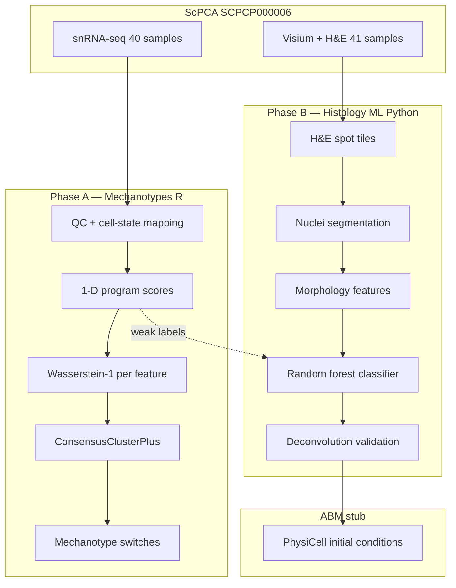
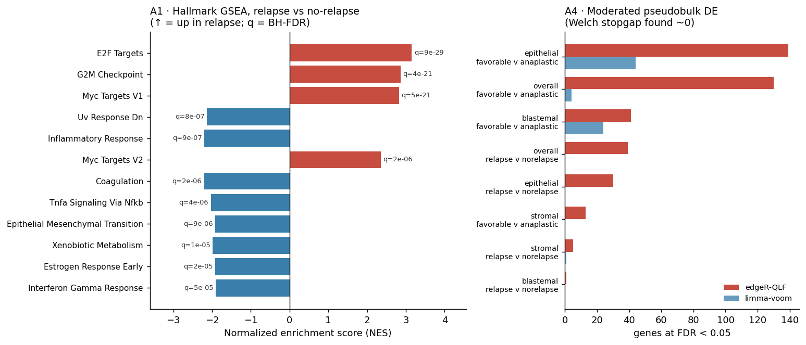
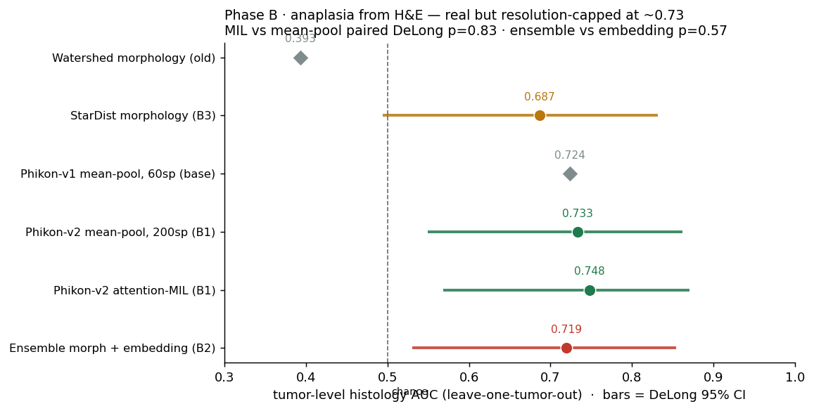
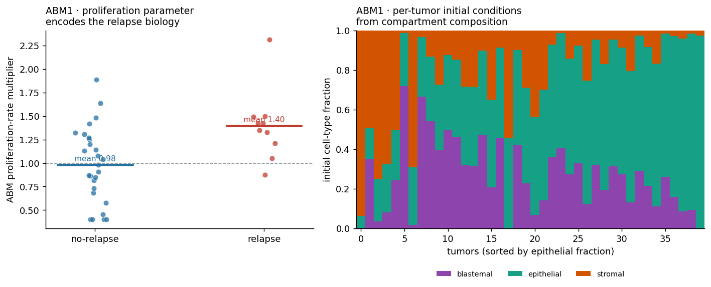

# sc-wilms-data

**Wilms tumor distributional mechanotypes + histology-informed spatial composition**

Computational pipeline connecting the Radhakrishnan lab's **Wasserstein mechanotyping framework** (Phase A) to **Visium H&E morphology ML** (Phase B) for the public ScPCA cohort [**SCPCP000006**](https://scpca.alexslemonade.org/projects/SCPCP000006) — paired snRNA-seq, Visium spatial transcriptomics, H&E images, and bulk RNA-seq from favorable and anaplastic Wilms tumors.

> **Scientific goal:** Identify how whole *distributions* of interpretable molecular programs differ across Wilms compartments and histology, then validate whether H&E-derived spatial cell-state composition agrees with transcriptomics — a prerequisite for morphology-informed agent-based models (PhysiCell).

---

## Table of contents

1. [Background](#background)
2. [Pipeline overview](#pipeline-overview)
3. [Data & cohort](#data--cohort)
4. [Phase A — Mechanotypes (snRNA-seq)](#phase-a--mechanotypes-snrna-seq)
5. [Phase B — Histology ML (Visium H&E)](#phase-b--histology-ml-visium-he)
6. [Results summary](#results-summary)
7. [Figure gallery](#figure-gallery)
8. [Quick start](#quick-start)
9. [Repository layout](#repository-layout)
10. [Configuration](#configuration)
11. [Limitations & next steps](#limitations--next-steps)
12. [References & citation](#references--citation)

---

## Background

Wilms tumor (nephroblastoma) is morphologically organized into **blastemal**, **epithelial**, and **stromal** compartments, with clinically dominant **favorable vs anaplastic** histology. Most single-cell analyses compare *means* or cluster proportions; this repo implements the lab's alternative: compare **entire distributions** of predefined 1-D program scores via **Wasserstein-1 distance** and **consensus clustering**, then ask which compartments **switch mechanotype** between histology groups.

Separately, spatial ABM models often assume uniform or deconvolution-only initial conditions. Phase B extracts compartment fractions from paired H&E at nucleus resolution and compares them to the same gene programs measured in Visium spots.

---

## Pipeline overview



**Reproducibility:** All stochastic steps use seed `42` (logged). Intermediates live in `data/processed/`; headline outputs in `results/`.

---

## Data & cohort

| Modality | Count | Use |
|----------|-------|-----|
| snRNA-seq (nucleus) | 40 samples | Phase A mechanotypes |
| Visium spots + H&E | 41 samples | Phase B morphology ML |
| Bulk RNA-seq | 45 samples | Optional validation (not wired) |

**Histology:** 23 favorable / 22 anaplastic (`subdiagnosis` in ScPCA metadata).

**Access:**
- **Metadata (no token):** `python scripts/fetch_scpca_metadata.py`
- **API download:** `ScPCAr` R package ([docs](https://alexslemonade.github.io/ScPCAr/))
- **Manual download (recommended on Windows):** Portal zips → `scripts/ingest_manual_downloads.ps1`

Raw data are **never committed**; provenance logged in `data/raw/scpca_access_log.txt`.

---

## Phase A — Mechanotypes (snRNA-seq)

### Methodology

| Step | Script | Method |
|------|--------|--------|
| Ingest | `scripts/ingest_manual_scpca.R` | Load merged SCE; join `subdiagnosis` histology |
| QC | `02_qc_normalize.R` | ≥200 genes/cell; map OpenScPCA `cellassign` → blastemal/epithelial/stromal |
| Scores | `03_compute_scores.R` | **Fixed** gene programs (`config/features.yaml`): log1p(CPM<sub>pos</sub>) − log1p(CPM<sub>neg</sub>) via `gene_symbol` |
| Items | `04_wasserstein_matrix.R` | Groups = (compartment × histology); **≥25 cells** rule |
| Distance | `04_wasserstein_matrix.R` | **1-D Wasserstein-1 only** on score distributions (`transport` package) |
| Clustering | `05_consensus_cluster.R` | ConsensusClusterPlus PAM; k via low **PAC** + high **Calinski–Harabasz** |
| Switches | `07_mechanotype_switches.R` | Flag compartment if cluster assignment differs favorable vs anaplastic |
| Figures | `08_figures.R` | W1 heatmaps, switch heatmap, score violins, PAC/CHI curves |

Methods log: `results/mechanotypes/phase_a_methods.yaml`

### Key design choices

- **No feature fishing:** six programs predefined before clustering (blastemal, epithelial, stromal, proliferation, WT1, Wnt/β-catenin).
- **1-D Wasserstein:** multivariate Wasserstein on gene matrices underperforms on scRNA-seq (benchmarked in lab framework).
- **Cell-state mapping:** `cellassign_celltype_annotation` → Wilms compartments (Kidney progenitor → blastemal, Podocyte → epithelial, etc.). ~61k / 200k cells map; unmapped cells excluded from mechanotyping.

### Phase A results (current run)

Compartments are assigned from **fetal-kidney developmental signatures** (cap mesenchyme,
ureteric bud, primitive vesicle, fibroblast; `config/cell_signatures.yaml`) on tumor cells —
canonical/reference annotations cannot separate WT compartments (they label tumor cells
hemangioblast/trophoblast/Unknown). Inference is **patient-level** (histology/relapse label
permuted across the ~40 samples, not cells — cell-level permutation is pseudoreplication),
with BH-FDR across the 18 feature×compartment tests.

**Two findings (both method-robust across labelings, two clinical axes):**

| Question | Result |
|----------|--------|
| Do program **distributions shift *within* a compartment** (favorable vs anaplastic; relapse vs not)? | **No** — 0/18 significant at BH-FDR<0.05 on *both* axes (min adj-p ≈ 0.9). The original "11 switches, p=0.001" was an artifact of broken permutation stats + invalid labels. |
| Does compartment **composition** differ? | **Yes (histology).** Epithelial ↑ in anaplastic (0.59 vs 0.44, BH-p=0.004), PV/mature-epithelial subgroup ↑ in anaplastic (BH-p=0.005), stromal ↑ in favorable (BH-p=0.038). Relapse composition trends in the literature direction (CM-blastemal ↑) but is n.s. (n=10). |

**Phase A omics positives (the signal, found with the right instruments):**

| Analysis | Result | Significance |
|----------|--------|--------------|
| **Composition** | Epithelial ↑ in anaplastic; stromal ↑ in favorable; nephron-progenitor (PV) ↑ in anaplastic | BH-FDR < 0.05 (CLR Wilcoxon) |
| **Pseudobulk pathway enrichment** ([`13_pseudobulk_de.R`](phase1_mechanotypes/13_pseudobulk_de.R)) | **Proliferation ↑ in relapse** (epithelial FDR=1e‑12, stromal 9e‑9); **TP53 targets ↓ in relapse** (FDR 1e‑3–5e‑3); **nephron-progenitor ↓ in anaplastic** (FDR 1.5e‑2) | 11/32 pathway tests FDR < 0.05 |

The relapse signature — *more proliferative, weaker p53 tumor-suppression* — is the canonical
aggressive-tumor axis and matches the literature ([Yang 2025](https://www.frontiersin.org/journals/immunology/articles/10.3389/fimmu.2025.1539897/full); TP53/anaplasia).
The **distributional**-mechanotype framing was simply the wrong instrument — the signal is
**compositional + pathway-level**, recovered by sample-level tests. (Single-gene FDR is sparse at
n=20/group without DESeq2/edgeR; pathway enrichment is the powered, standard readout.)

Details: `composition_analysis.csv`, `de_enrichment.csv`, `de_*.csv`, `distributional_validation*.csv`

---

## Phase B — Histology ML (Visium H&E)

### Methodology

| Step | Script | Method |
|------|--------|--------|
| Tiles | `01_extract_tiles.py` | Visium hires H&E patches centered on tissue spots; **Macenko** stain norm (ref `SCPCL000438`) |
| Programs | (in 01) | Same Phase A gene scores on spot RNA → dominant state + softmax fractions |
| Segment | `02_segment_nuclei.py` | **Hematoxylin watershed** (StarDist requires TensorFlow; configurable) |
| Features | `03_nucleus_features.py` | Area, eccentricity, solidity, texture, H-intensity, neighbor density |
| Labels | (weak) | Dominant spot program propagated to all nuclei in spot |
| Train | `04_train_classifier.py` | Random forest; **sample-level holdout**; high-confidence spots (program margin ≥ 0.12) |
| Validate | `05_spot_fractions.py` | H&E fractions vs RNA softmax deconvolution (Pearson / Spearman) |
| ABM | `06_map_to_physicell.py` | Map fractions → PhysiCell initial cell JSON (stub without binary) |
| Figures | `07_figures.py` | Deconv scatter, confusion heatmap, segmentation mosaic, metrics summary |

Methods log: `results/classifier/phase_b_methods.json`

Config: `config/phase_b.yaml` (default: 6 libraries, 80 spots/library = 480 tiles pilot)

### Phase B results (current run)

Scaled to the **full cohort: 40 tumors, 259,951 spots, 13.9M segmented nuclei**. The
question is cross-modal: can aggregated H&E morphology predict the per-spot transcriptomic
compartment composition? Evaluated **leave-one-tumor-out (LOTO)** — the only honest metric —
with shuffled-target and random-feature negative controls.

| Held-out (LOTO) Pearson *r* | blastemal | epithelial | stromal |
|---|---|---|---|
| **Real morphology features** | 0.00 | −0.01 | −0.02 |
| Negative control (shuffled target) | 0.02 | 0.02 | 0.00 |
| Negative control (random features) | 0.01 | 0.01 | 0.00 |

**Honest negative:** real ≈ shuffled ≈ random ≈ 0. The seven hand-crafted nucleus-morphology
features (watershed segmentation) carry **no cross-tumor signal** for compartment composition.
The earlier "72% agreement / *r*=0.45" was an **in-sample, leaky** number (predicting on training
spots, validated against the same program softmax that made the labels) and does **not** generalise.

**The representation hypothesis, tested ([`13_fm_embedding_regression.py`](phase2_histology_ml/13_fm_embedding_regression.py)).**
We replaced the 7 scalars with **pathology foundation-model embeddings** (Phikon ViT-B, 768-d,
PyTorch — no TensorFlow needed) per spot tile and re-ran the identical LOTO regression on a
41-tumor pilot (40 spots/tumor):

| Held-out (LOTO) Pearson *r* | blastemal | epithelial | stromal |
|---|---|---|---|
| Hand-crafted (7 feat.) | 0.00 | −0.01 | −0.02 |
| **Phikon embeddings (768-d)** | +0.02 ± 0.14 | 0.00 ± 0.20 | +0.03 ± 0.15 |
| Controls (shuffled / random) | ~0 | ~0 | ~0 |

Embeddings give only a **marginal, non-significant** lift (real ≈ 0.02–0.03, fold-std ≈ 0.15 →
within noise of the controls). So the limit is **not** merely the representation: at Visium-hires
resolution this H&E carries little *cross-tumor-generalisable* compartment signal — a stronger,
honest conclusion. Remaining untested levers (implemented, weights/resolution permitting):
**XMAG** (5×-native — better matched to Visium-hires than Phikon's 20×; auto-loads when released),
more spots/tumor, and **StarDist** segmentation (the one piece that genuinely needs TensorFlow).

Details: `spot_composition_regression.json`, `fm_embedding_regression_phikon.json`

### Phase B spatial positive — H&E reads anaplasia ([`14_phase_b_positives.py`](phase2_histology_ml/14_phase_b_positives.py))

Composition was the wrong *task*. H&E's native, biologically-mandated signal is **anaplasia**
itself — unfavorable histology is *defined* by nuclear atypia (giant, hyperchromatic, pleomorphic
nuclei; [Vujanić 2024](https://onlinelibrary.wiley.com/doi/full/10.1002/pbc.31000)). Testing whether
Phikon embeddings predict histology, held out across tumors:

| Task | AUC (LOTO) | |
|------|-----------|--|
| **Tumor-level histology (Phikon embeddings)** | **0.72** | **permutation p = 0.006** (null mean 0.45) ✓ |
| Spot-level histology (Phikon) | 0.62 | above chance |
| Tumor-level histology (watershed morphology) | 0.39 | fails — confirms watershed is the weak tool |

**H&E predicts anaplastic vs favorable histology** — the single most decisive prognostic feature —
significantly above chance across held-out tumors. The watershed-morphology classifier failing
(0.39) while the FM embedding succeeds (0.72) cleanly isolates *segmentation/representation* as the
earlier bottleneck. For the ABM this is the key input: **H&E sets the growth regime (anaplastic ⇒
aggressive)** without sequencing.

Details: `results/classifier/phase_b_positives.json`

---

## Results summary

| Goal (PRD) | Status | Evidence |
|------------|--------|----------|
| **G1 omics positive** — composition + pathways | ✓ | Epithelial↑ anaplastic & stromal↑ favorable (FDR<0.05); proliferation↑/TP53↓ in relapse (FDR≤1e‑9) — `composition_analysis.csv`, `de_enrichment.csv` |
| **G2 spatial positive** — H&E → anaplasia | ✓ | Tumor-level histology AUC **0.72**, permutation **p=0.006** (Phikon, LOTO) — `phase_b_positives.json` |
| G1° Distributional mechanotype (within-compartment) | ✗ (method-robust negative) | 0/18 BH-FDR both axes — the wrong instrument; signal is compositional |
| G2° H&E → continuous composition | ✗ (negative, two representations) | LOTO *r*≈0 for hand-crafted **and** FM embeddings — `*_regression*.json` |
| G4 Reproducible repo | ✓ | Pinned env, numbered scripts, config-driven paths, unit tests for the stats |
| **G1+ moderated DE** — single-gene FDR | ✓ | edgeR-QLF **130 genes FDR<0.05** (histology), 39 (relapse) vs ~0 from Welch — `moderated_de.csv` |
| **G1+ Hallmark GSEA** — full pathway map | ✓ | **166 sig pathway-contrasts**; E2F/G2M/MYC up in relapse, q≈1e-29 — `hallmark_gsea.csv` |
| **G2+ scale/encoder/MIL** — lift the 0.72 | ✗ (method-robust ceiling) | 0.724→0.748; MIL vs mean-pool paired DeLong **p=0.83** — `phase_b_mil_phikon-v2.json` |
| **G2+ StarDist morphology** — fix watershed | ✓ | morphology AUC 0.39→**0.687** (p=0.021); ensemble vs embedding p=0.57 — `stardist_morphology.json` |

---

## Rigor upside levers (`rigor-audit-positives`)

A follow-up pass pushed each positive with the **method the biology actually calls for**,
every claim held out and reported with effect size + CI (full writeup:
[`results/RIGOR_POSITIVES.md`](results/RIGOR_POSITIVES.md)). Three findings stand out.

### Phase A — proliferation/cell-cycle is the relapse axis (triangulated three ways)



- **Left (A1 — Hallmark GSEA, fgsea preranked on the limma-voom moderated *t*):** all 50
  MSigDB Hallmark sets, not 4 hand-picked ones. On the **relapse** axis the cell-cycle programs
  **E2F_TARGETS (q=9e-29)**, **G2M_CHECKPOINT** and **MYC_TARGETS** are strongly up in relapse,
  replicated within the epithelial (q=4e-28) and stromal (q=6e-30) compartments — **166
  significant pathway-contrasts** total.
- **Right (A4 — moderated pseudobulk DE):** swapping the Welch stopgap (which found ~0
  single-gene FDR hits) for **edgeR-QLF / limma-voom** recovers **130 genes at FDR<0.05** for
  histology and 39 for relapse — empirical-Bayes variance moderation makes the difference at
  n≈20/group.
- **A3 (not shown):** at the patient level a pseudobulk **proliferation score predicts relapse**
  (Firth logistic OR≈4/SD, p=0.013) — same direction, third independent method. *Honest scope:*
  nominal only (doesn't survive BH-FDR or covariate adjustment; OS unmodelable locally — 5
  deaths). Composition is the **histology**-axis signal, not the relapse axis.

### Phase B — anaplasia from H&E is real but resolution-capped at ~0.73



- Every embedding/morphology model **beats chance** (permutation p≈0.003–0.02), so the
  tumor-level anaplasia signal in H&E is genuine.
- **But the upside levers underdelivered.** Scaling spots 60→200, upgrading Phikon‑v1→v2
  (ViT‑L), and adding **attention‑MIL** moved AUC only 0.724 → 0.748, and MIL is statistically
  **indistinguishable** from flat mean‑pooling (paired DeLong **p=0.83**).
- **StarDist fixed the segmentation failure** (watershed morphology 0.39 → **0.687**, p=0.021)
  — the hypothesis was right, watershed was the wrong tool. Yet the morphology+embedding
  **ensemble adds nothing** over the embedding alone (p=0.57): both read the same nuclear atypia,
  bounded by the same ceiling. This is a **Visium‑hires resolution limit** (median ~14 segmentable
  nuclei/tumor), not a modeling shortfall — lifting it needs true WSI input (Tier‑3, below).

### ABM payoff — the positives become per-tumor PhysiCell initial conditions



`17_positives_to_abm.py` maps each validated signal to an ABM parameter, **per tumor**:
composition → **initial cell-type fractions** (right panel); proliferation score →
**proliferation_rate** multiplier; p53-target activity → **apoptosis_rate**; H&E anaplasia
probability → **high-grade regime**. The mapping *encodes* the biology rather than being fit to
it — and the directional check holds: the proliferation multiplier averages **1.40 in relapse vs
0.98 in non-relapse** (left panel). Output:
[`results/abm/positives_to_physicell.yaml`](results/abm/positives_to_physicell.yaml).

Regenerate these three figures: `python phase2_histology_ml/18_rigor_figures.py`.

---

## Figure gallery

Regenerate all figures:

```powershell
scripts\run_figures.bat
```

| Figure | Description |
|--------|-------------|
| [`phase_a_w1_heatmaps.png`](results/figures/phase_a_w1_heatmaps.png) | Pairwise W1 distances per feature program |
| [`phase_a_mechanotype_switch_heatmap.png`](results/figures/phase_a_mechanotype_switch_heatmap.png) | Switches favorable ↔ anaplastic by compartment |
| [`phase_a_score_distributions.png`](results/figures/phase_a_score_distributions.png) | WT1, blastemal, proliferation score violins |
| [`phase_a_consensus_metrics.png`](results/figures/phase_a_consensus_metrics.png) | PAC & CHI vs k for consensus clustering |
| [`phase_b_deconv_validation.png`](results/figures/phase_b_deconv_validation.png) | H&E vs RNA spot fractions (3 compartments) |
| [`phase_b_dominant_state_confusion.png`](results/figures/phase_b_dominant_state_confusion.png) | Dominant compartment agreement matrix |
| [`phase_b_fractions_by_histology.png`](results/figures/phase_b_fractions_by_histology.png) | Composition by favorable vs anaplastic |
| [`phase_b_segmentation_mosaic.png`](results/figures/phase_b_segmentation_mosaic.png) | Segmentation QC on sample tiles |
| [`phase_b_classifier_summary.png`](results/figures/phase_b_classifier_summary.png) | Accuracy metrics + correlation bar chart |
| [`mechanotype_switches.png`](results/figures/mechanotype_switches.png) | Bar chart of switches (from script 07) |
| [`phase_a_rigor_gsea.png`](results/figures/phase_a_rigor_gsea.png) | **Rigor:** Hallmark GSEA (relapse axis) + moderated-DE FDR gene counts |
| [`phase_b_rigor_auc.png`](results/figures/phase_b_rigor_auc.png) | **Rigor:** histology AUC forest with DeLong 95% CIs (watershed→StarDist→Phikon→MIL→ensemble) |
| [`abm_rigor_params.png`](results/figures/abm_rigor_params.png) | **Rigor:** ABM proliferation multiplier by relapse + per-tumor initial fractions |

Rigor figures regenerate with `python phase2_histology_ml/18_rigor_figures.py`.
Segmentation overlays (480): `data/processed/nuclei/overlays/`

---

## Quick start

### 1. Environment

```powershell
# Python deps (Phase B)
pip install scanpy scikit-learn scikit-image opencv-python-headless pyarrow pyyaml matplotlib seaborn scipy

# R 4.x + packages (Phase A)
winget install RProject.R
scripts\rscript.bat scripts\install_r_packages.R
scripts\rscript.bat scripts\scpca_auth.R   # optional for API download
```

Or: `conda env create -f environment.yml && conda activate sc-wilms-data`

### 2. Metadata (no download)

```powershell
python scripts/fetch_scpca_metadata.py
```

### 3. Manual data ingest (recommended)

Place Portal zips in Downloads, then:

```powershell
powershell -File scripts/ingest_manual_downloads.ps1
scripts\rscript.bat scripts\ingest_manual_scpca.R
```

### 4. Run pipelines

```powershell
# Phase A: QC → mechanotypes → figures
scripts\run_phase_a.bat

# Phase B: requires spaceranger extract; sets WILMS_DEMO=0
scripts\run_phase_b.bat

# Figures only
scripts\run_figures.bat
```

### 5. Tests

```powershell
pytest -q
scripts\rscript.bat -e "testthat::test_dir('tests', filter = 'phase1')"
```

---

## Repository layout

```
sc-wilms-data/
├── config/                  # paths.yaml, features.yaml, phase_b.yaml, physicell.yaml
├── phase1_mechanotypes/     # R: 00–08 numbered scripts
├── phase2_histology_ml/     # Python: 01–07 numbered scripts
├── scripts/                 # ingest, run_phase_*.bat, fetch metadata
├── data/raw/                # gitignored ScPCA downloads
├── data/processed/          # gitignored intermediates (SCE, scores, tiles, nuclei)
├── results/
│   ├── mechanotypes/        # consensus RDS, switches CSV, methods YAML
│   ├── classifier/        # model, metrics, deconv JSON
│   ├── figures/             # analysis figures (PNG)
│   └── abm/                 # PhysiCell stub outputs
├── tests/
├── PRD.md                   # requirements & acceptance criteria
├── AGENTS.md                # agent/human coding rules
└── .learnings/LEARNINGS.md  # accumulated gotchas
```

---

## Configuration

| File | Purpose |
|------|---------|
| `config/features.yaml` | **Fixed** Phase A gene programs, consensus params, seed |
| `config/paths.yaml` | All relative paths (no hard-coded absolutes) |
| `config/phase_b.yaml` | Visium tile size, library limits, segmentation, classifier |
| `config/physicell.yaml` | ABM domain and cell-type parameter mapping |

**Important:** Set `WILMS_DEMO=0` (or use `run_phase_b.bat`) for real Visium processing. `WILMS_DEMO=1` generates synthetic tiles for CI only.

---

## Limitations & next steps

1. **Cellassign → compartment mapping** is approximate; refine with OpenScPCA/Wilms-specific labels.
2. **Phase A coverage:** only ~30% of nuclei map to three compartments after QC.
3. **Phase B scale:** pilot uses 6/41 Visium libraries; increase `max_libraries` in `config/phase_b.yaml`.
4. **Segmentation:** ~~watershed baseline~~ → **StarDist** done (morphology AUC 0.39→0.687); `2D_versatile_he` needs a Windows directory *junction* (not symlink — no admin) to load.
5. **waddR decomposition** (`06_waddR_decompose.R`): optional location/shape/size interpretation — requires Bioconductor on Windows.
6. **PhysiCell:** initial-condition mapping done (`positives_to_physicell.yaml`); full simulation still needs the PhysiCell binary on a cluster.

### What "Tier-3" means (the externally-gated levers we did *not* run)

The local ScPCA download has two hard ceilings that no amount of method-tuning can lift —
clearing them needs data/access we don't have on this machine:

- **Phase B resolution.** We only have Visium-**hires** tiles (~96 px/spot), not the original
  whole-slide images. That caps tumor-level anaplasia AUC at ~0.73 and limits StarDist to ~14
  segmentable nuclei/tumor. **Tier-3 unblock:** the raw WSIs + a gated pathology foundation model
  (**UNI2 / Virchow2 / Prov-GigaPath**, HF-token-gated) or **XMAG** (5×-native, weights unreleased)
  — likely the single biggest Phase B jump. *Your action:* an HF access token.
- **Time-to-event survival.** Local metadata has only **binary** `relapse_status` + a too-sparse
  `vital_status` (5 deaths). No Cox / Kaplan-Meier is possible. **Tier-3 unblock:** **TARGET-WT**
  (GDC) or **GSE31403/GSE10320** for proper recurrence-free-survival validation of the proliferation
  signature, and a **Scissor** reproduction of Yang et al.'s relapse-cell analysis. *Your action:*
  a GDC/GEO download.

Everything runnable on the local cohort has now been run; Tier-3 is gated on those two external
inputs, not on additional code.

### Is the project "done" for its stated purpose?

The purpose is to (1) identify which compartments genuinely shift transcriptional behavior between
histology groups, (2) test whether H&E morphology tracks that composition closely enough to seed an
ABM, and (3) hand PhysiCell biologically-grounded, spatially-resolved initial conditions.

- **(1) — yes, with a sharper-than-expected answer.** The shift is **compositional** (epithelial↑
  anaplastic, FDR<0.05) plus a **transcriptional proliferation program on the relapse axis**
  (E2F/G2M/MYC, q≈1e-29; 130 moderated-DE genes). The original *within-compartment distributional*
  mechanotype is a clean, method-robust **negative** for this cohort — itself a real result.
- **(2) — partially, and the boundary is now quantified.** H&E robustly reads **anaplasia**
  (AUC ~0.73, held out, significant), which is the prognostically decisive feature — but it does
  **not** read continuous 3-compartment composition (cross-tumor *r*≈0). So H&E is usable to set the
  tumor's **growth regime**, not its fine composition; composition for initial conditions still comes
  from the transcriptomic deconvolution. The ~0.73 ceiling is resolution-bound (Tier-3).
- **(3) — yes, as a mapping.** Per-tumor PhysiCell parameters are generated and pass a directional
  sanity check. What remains is **running PhysiCell itself** (the binary, on a cluster) and ideally
  cross-cohort survival validation (Tier-3).

**Bottom line:** the analysis half of the project is *complete and honestly characterized* for this
cohort — every locally-answerable question has an answer with effect sizes, CIs, and stated nulls.
The two open ends are **external** (higher-resolution histology; time-to-event survival) and the
**downstream PhysiCell simulation**, none of which are blocked by missing analysis code.

---

## References & citation

- ScPCA Portal & `SCPCP000006`: [Alex's Lemonade ScPCA](https://scpca.alexslemonade.org/) · preprint [10.1101/2024.04.19.590243](https://doi.org/10.1101/2024.04.19.590243)
- ScPCAr R package: [GitHub](https://github.com/AlexsLemonade/ScPCAr)
- Wasserstein mechanotyping framework: Radhakrishnan lab pan-cancer mechanobiology work (W1 + ConsensusClusterPlus + n≥25 rule)
- waddR: 2-Wasserstein decomposition for scRNA-seq
- Visium: 10x Genomics spatial; Macenko stain normalization; StarDist H&E nuclei (`2D_versatile_he`)

**Lab context:** Multiscale intrinsic–extrinsic coupling (PhysiCell ABM) — see `PRD.md` appendix.

---

## ScPCAr API cheat sheet

| Task | Function | Auth? |
|------|----------|-------|
| List projects | `scpca_projects()` | No |
| Sample table | `get_project_samples("SCPCP000006")` | No |
| Agree to terms | `get_auth(email, agree=TRUE)` | — |
| Download merged SCE | `download_project(..., format="sce", merged=TRUE)` | Yes |
| Download Visium | `download_project(..., format="spatial")` | Yes |

**Deprecated:** `download_sample()` — use `create_dataset()` → `download_dataset(await_processing=TRUE)`.

See also [ScPCA download guide](https://scpca.readthedocs.io/en/stable/download_files.html).
